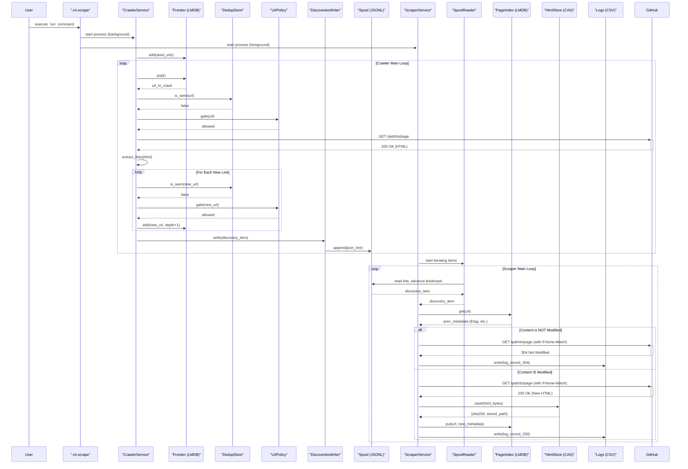

# System Architecture

This document provides a detailed description of the system architecture, its components, data flows, and key design decisions.

## 1. High-Level Overview

The system is a specialized data pipeline designed to crawl and scrape GitHub repositories. It is composed of two primary, decoupled services: the **Crawler** and the **Scraper**.

-   **Crawler (`crawler/`)**: This service is responsible for discovering URLs. It starts with a set of seed URLs and traverses GitHub, respecting `robots.txt` and a predefined scope policy. Discovered URLs are written to a shared spool area.
-   **Scraper (`scraper/`)**: This service tails the discovery spool, fetches the HTML content for each URL, stores it in a content-addressed storage system, and records metadata for future conditional fetching.

A command-line interface, `vi-scrape`, acts as the main user entry point for configuring the workspace, running both services, and resetting the system state. The decoupling of services via the spool directory allows them to operate independently and at different rates.

## 2. Architecture Diagram

```mermaid
graph TD
    subgraph User Interaction
        CLI("`./vi-scrape` CLI")
        Seeds("`seeds.txt`")
    end

    subgraph Crawler Service
        direction LR
        C_Run("`run.py`")
        C_Frontier("`Frontier (LMDB)`")
        C_Dedup("`DedupStore (File-based)`")
        C_Policy("`UrlPolicy` & `RobotsCache`")
        C_Fetcher("`CrawlerFetcher`")
        C_Extractor("`LinkExtractor`")
        C_Writer("`DiscoveriesWriter`")
    end

    subgraph Scraper Service
        direction LR
        S_Run("`run.py`")
        S_Spool("`SpoolReader`")
        S_Fetcher("`ScraperFetcher`")
        S_Store("`HtmlStore (CAS)`")
        S_Index("`PageIndex (LMDB)`")
        S_CSV("`CSV Writers`")
        S_Control("`ControlFlags`")
    end

    subgraph Data Persistence
        direction TB
        SpoolDir("`workspace/spool/discoveries/`")
        Bookmark("`workspace/state/spool_bookmark.json`")
        HTMLStore("`workspace/store/html/`")
        PageIndexDB("`workspace/state/page_index.lmdb/`")
        Logs("`workspace/logs/`")
    end
    
    subgraph External
        GitHub("GitHub Servers")
    end

    %% Connections
    CLI -- "uses" --> Seeds
    CLI -- "starts" --> C_Run
    CLI -- "starts" --> S_Run

    C_Run -- "manages" --> C_Frontier
    C_Run -- "uses" --> C_Dedup
    C_Run -- "enforces" --> C_Policy
    C_Run -- "uses" --> C_Fetcher
    C_Fetcher -- "fetches from" --> GitHub
    C_Fetcher -- "returns HTML to" --> C_Run
    C_Run -- "uses" --> C_Extractor
    C_Extractor -- "extracts links for" --> C_Run
    C_Run -- "adds new URLs to" --> C_Frontier
    C_Run -- "writes discoveries via" --> C_Writer
    C_Writer -- "writes to" --> SpoolDir

    S_Run -- "reads from" --> S_Spool
    S_Spool -- "reads" --> SpoolDir
    S_Spool -- "uses/updates" --> Bookmark
    S_Run -- "uses" --> S_Fetcher
    S_Fetcher -- "conditionally fetches from" --> GitHub
    S_Fetcher -- "uses" --> S_Index
    S_Run -- "saves content via" --> S_Store
    S_Store -- "writes to" --> HTMLStore
    S_Run -- "updates" --> S_Index
    S_Index -- "writes to" --> PageIndexDB
    S_Run -- "writes logs via" --> S_CSV
    S_CSV -- "writes to" --> Logs
    S_Run -- "checks" --> S_Control
```

## 3. Component Deep Dive

### 3.1. Crawler Service (`crawler/`)

The crawler's primary goal is to explore GitHub and produce a stream of in-scope URLs for the scraper.

-   **`run.py`**: The main service entry point. It orchestrates the entire crawl loop: popping a URL, checking policies, fetching, extracting links, and writing discoveries.
-   **`frontier/frontier.py`**: An **LMDB-backed persistent priority queue**. It stores URLs to be crawled. A URL's priority is determined by its crawl depth, ensuring a breadth-first traversal. The use of LMDB makes the frontier durable across restarts.
-   **`frontier/dedup.py`**: A **file-based deduplication store**. To avoid processing the same URL multiple times, the crawler checks against this store. It uses a sharded directory structure based on the URL's SHA256 hash, making checks extremely fast (a file existence check).
-   **`policy.py`**: Implements the crawling rules. It uses a deny-by-default approach, checking URLs against configurable allow/deny regex patterns and a list of allowed hosts.
-   **`robots_cache.py`**: Works with `policy.py` to ensure `robots.txt` rules are respected. It caches `robots.txt` files to avoid re-fetching them for every URL on the same host.
-   **`net/fetcher.py`**: A simple, robust asynchronous HTTP client based on `httpx`. It includes rate limiting, retry logic with exponential backoff, and timeout handling.
-   **`parse/extractor.py`**: Extracts `<a>` href links from fetched HTML content, which are then canonicalized and considered for addition to the frontier.
-   **`io/discoveries.py`**: A writer that appends discovered URLs as JSON objects to a `.jsonl` file in the spool directory. Each write is flushed and synced to disk (`fsync`), ensuring the scraper can consume the data in near real-time.

### 3.2. Scraper Service (`scraper/`)

The scraper consumes the output of the crawler, fetches the actual content, and archives it intelligently.

-   **`run.py`**: The orchestrator for the scraping process. It manages the main loop of reading from the spool, fetching, storing, and indexing. It also sets up signal handlers for graceful shutdown, status reporting, and configuration reloads.
-   **`io/spool.py`**: A resilient **spool reader**. It tails the `discoveries-*.jsonl` files produced by the crawler. Its key feature is the use of a **bookmark** (`spool_bookmark.json`), which stores the last-read file and byte offset. This allows the scraper to be stopped and restarted without losing its place.
-   **`net/fetcher.py`**: A more advanced `httpx`-based fetcher. Its key feature is making **conditional requests**. Before fetching a URL, it queries the `PageIndex` for the `ETag` or `Last-Modified` headers from the previous fetch. If the server responds with `304 Not Modified`, no data is downloaded, saving significant bandwidth and time. It also supports a pool of proxies for large-scale scraping.
-   **`io/storage.py`**: A **content-addressed storage (CAS)** system for HTML. Content is stored based on its SHA256 hash, which provides automatic deduplication at the storage layer. Files are stored in a sharded directory structure (e.g., `store/html/ab/cd/<hash>.html`) to keep directory sizes manageable. It also supports optional `zstandard` compression.
-   **`index/page_index.py`**: An **LMDB-based index** that maps a canonical URL to its metadata. This includes the content's SHA256 hash, its path in the `HtmlStore`, and the `ETag`/`Last-Modified` headers. This index is the backbone of the conditional fetching mechanism.
-   **`io/csv_writer.py` & `io/metrics.py`**: These modules handle structured logging. `PagesCsv` writes a detailed record for every page fetched, while `Metrics` periodically flushes operational statistics to a separate CSV file for monitoring.
-   **`control/flags.py`**: Provides a simple file-based mechanism for controlling the scraper. By creating `pause.scraper` or `stop.scraper` in the workspace, an operator can pause or gracefully shut down the service.

### 3.3. Orchestration (`vi-scrape`)

The `vi-scrape` script is the user-facing wrapper that simplifies running the system.

-   **`configure`**: Prepares the workspace by creating the necessary directory structure and default configuration files.
-   **`run`**: Starts the crawler as a background process and the scraper in the foreground. This design ensures that `Ctrl+C` is caught by the scraper for a graceful shutdown, which then triggers the termination of the crawler process.
-   **`reset`**: Wipes the workspace to allow for a clean run.

## 4. Data Flow

1.  **Initiation**: The user runs `./vi-scrape run`. The crawler is seeded with URLs from `seeds.txt`.
2.  **Discovery**: The **Crawler** begins its loop: it pops a URL from the `Frontier`, verifies it hasn't been `seen` and is `in-policy`, fetches it, and extracts new links. The new links are added back to the `Frontier`.
3.  **Spooling**: The original URL is written as a JSON line to a `discoveries-*.jsonl` file in the `workspace/spool/discoveries/` directory.
4.  **Consumption**: The **Scraper**'s `SpoolReader` detects the new line in the spool file and yields the JSON object to the scraper's main loop. It updates its `spool_bookmark.json` periodically.
5.  **Conditional Fetch**: The scraper looks up the URL in the `PageIndex`. If an entry exists, it uses the stored `ETag` and `Last-Modified` headers to make a conditional request.
6.  **Storage**: If new content is received (i.e., not a `304` response), its SHA256 hash is calculated. The content is saved to the `HtmlStore` at a path derived from the hash.
7.  **Indexing**: The `PageIndex` is updated with the URL, its new content hash, storage path, and the latest `ETag`/`Last-Modified` headers from the response.
8.  **Logging**: A record of the scrape event (URL, status, timestamp, etc.) is appended to `workspace/logs/pages-*.csv`.

This cycle repeats, with the crawler producing URLs and the scraper consuming them, allowing the two processes to work in parallel.

## 5. Crawler Pipeline: Step-by-Step

The crawler's purpose is to discover valid, in-scope URLs from the GitHub domain and pass them to the scraper. It acts as a producer in a producer-consumer pattern.

1.  **Initiation and Seeding**
    *   **Entry Point**: The process is started by the `./vi-scrape run` command, which executes `crawler/run.py`.
    *   **Initialization**: A `CrawlerService` object is created. It initializes several key components:
        *   `Frontier`: An LMDB database (`workspace/state/frontier.lmdb/`) that acts as a persistent priority queue for URLs to be crawled.
        *   `DedupStore`: A file-based hash set (`workspace/state/seen/`) used to track already-processed URLs and prevent re-crawling.
        *   `UrlPolicy` & `RobotsCache`: Classes that enforce crawling rules defined in the configuration and respect GitHub's `robots.txt`.
        *   `DiscoveriesWriter`: A writer that appends discovered URLs to JSONL files in the spool directory.
    *   **Seeding**: The initial URLs from `seeds.txt` are added to the `Frontier` with the highest priority (a score of `0.0`).

2.  **The Crawl Loop**
    The crawler enters a loop, performing the following steps for each URL:
    *   **Step 1: Pop from Frontier**: It retrieves the highest-priority URL from the `Frontier`. The use of a scored queue ensures the crawl proceeds in a breadth-first manner.
    *   **Step 2: Deduplication Check**: The URL is checked against the `DedupStore`.
        *   **How it works**: The canonical URL is hashed using SHA256. The system then checks for the existence of a file at a path derived from the hash (e.g., `workspace/state/seen/aa/bb/<hash>.seen`).
        *   **Outcome**: If the file exists, the URL has been seen before, and the loop restarts with the next URL.
    *   **Step 3: Policy Enforcement**: The URL is passed through the `UrlPolicy.gate()`. This function performs a series of checks:
        *   Is the host `github.com`?
        *   Does it match any configured `deny_patterns`?
        *   Does it match at least one `allow_patterns`?
        *   Does the cached `robots.txt` for `github.com` permit crawling this URL path?
        *   **Outcome**: If any check fails, the URL is discarded.
    *   **Step 4: Fetch Content**: If the policy is passed, the `CrawlerFetcher` downloads the page's HTML using the `httpx` library. This fetcher includes rate limiting to avoid overwhelming the server and exponential backoff for retrying failed requests.
    *   **Step 5: Extract Links**: On a successful download, the HTML content is passed to the `LinkExtractor`. It uses regular expressions to find all unique `href` values within `<a>` tags, which are then canonicalized into absolute URLs.
    *   **Step 6: Enqueue New Links**: Each newly extracted link is passed through the same deduplication and policy checks (Steps 2 & 3). If a link is valid and new, it is added to the `Frontier` with a lower priority (its depth score is incremented), ensuring it will be crawled after all other URLs at the current depth.
    *   **Step 7: Write Discovery**: The original URL that was successfully fetched is packaged into a JSON object containing metadata (URL, page type, crawl depth, referrer). This object is written as a new line to a `discoveries-<timestamp>.jsonl` file in `workspace/spool/discoveries/`. The file is immediately flushed to disk (`os.fsync`) to make it visible to the scraper.

## 6. Scraper Pipeline: Step-by-Step

The scraper's purpose is to consume the URLs discovered by the crawler, intelligently fetch and store their content, and maintain a detailed index for future efficiency.

1.  **Initiation**
    *   **Entry Point**: The `./vi-scrape run` command starts `scraper/run.py` in the foreground.
    *   **Initialization**: A `ScraperService` object is created, which initializes its components:
        *   `SpoolReader`: A reader that tails the discovery files written by the crawler.
        *   `PageIndex`: An LMDB database (`workspace/state/page_index.lmdb/`) that maps URLs to their content metadata (hash, storage path, and HTTP cache headers).
        *   `HtmlStore`: A content-addressed file storage system for the raw HTML (`workspace/store/html/`).
        *   `Fetcher`: An advanced HTTP client capable of conditional requests.
        *   `ControlFlags`: A mechanism to check for `pause.scraper` or `stop.scraper` files.

2.  **The Scrape Loop**
    The scraper enters a continuous loop, processing each discovery from the spool.
    *   **Step 1: Read from Spool**: The `SpoolReader` reads from the `discoveries-*.jsonl` files.
        *   **How it works**: It uses a bookmark file (`workspace/state/spool_bookmark.json`) that records the last file and byte offset it successfully processed. On startup, it loads this bookmark, seeks to that position, and begins reading. This makes the process resilient to restarts.
        *   **Outcome**: It yields a continuous stream of discovery JSON objects.
    *   **Step 2: Check Control Flags**: Before processing an item, the loop checks for the existence of `pause.scraper` or `stop.scraper` files, allowing an operator to pause or gracefully shut down the service.
    *   **Step 3: Query the Index**: The scraper queries the `PageIndex` using the URL from the discovery item. This retrieves the record from the last time the page was scraped, if any. This record contains the `ETag` and `Last-Modified` headers.
    *   **Step 4: Conditional Fetch**: The `Fetcher` makes an HTTP GET request.
        *   **How it works**: If a previous record was found in the index, the fetcher adds the `If-None-Match` (with the old `ETag`) and `If-Modified-Since` (with the old `Last-Modified` date) headers to the request.
        *   **Outcome 1 (Content Unchanged)**: If the server responds with `304 Not Modified`, it means the content is identical to the last version scraped. The fetcher reports this, and the scraper skips the storage and indexing steps, saving significant resources.
        *   **Outcome 2 (New Content)**: If the server responds with `200 OK`, it sends the new HTML content.
    *   **Step 5: Store Content**: If new HTML was received, it is passed to the `HtmlStore`.
        *   **How it works**: The store calculates the SHA256 hash of the raw HTML bytes. This hash becomes the content's unique identifier. The content (optionally compressed with `zstandard`) is saved to a sharded path derived from the hash (e.g., `workspace/store/html/aa/bb/<hash>.html.zst`).
        *   **Outcome**: This content-addressed storage automatically deduplicates identical pages at the storage layer.
    *   **Step 6: Update Index**: The scraper updates the `PageIndex` with a new record for the URL. This record includes the new content hash from the `HtmlStore`, the path to the stored file, and the new `ETag` and `Last-Modified` headers from the latest HTTP response. This keeps the index current for the next conditional fetch.
    *   **Step 7: Log Results**: A detailed record of the entire operation (URL, status code, latency, content hash, whether it was a `304` hit, etc.) is written as a new row in a CSV file in `workspace/logs/`.

## 7. UML Sequence Diagram

This sequence diagram illustrates the detailed interactions between the components of the crawler and scraper pipelines during a typical run.


