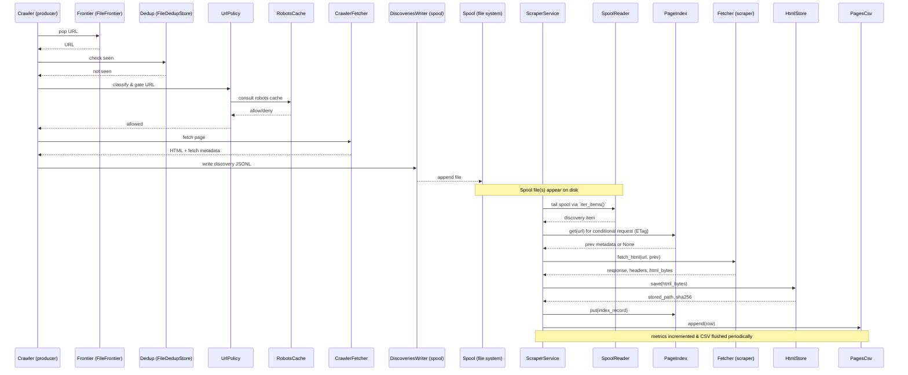
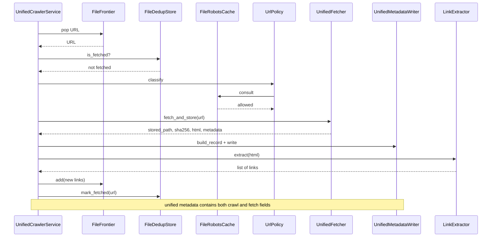

# Architecture Overview

This document describes the architecture of the GitHub-focused crawler & scraper
project. It maps modules to responsibilities, describes data flows and file
layout, and includes mermaid diagrams that illustrate interactions and the
crawl/scrape pipelines.

## High-level modes

There are two coexisting modes in this repository:

- Separated mode: `crawler/` (discovery producer) writes newline-delimited
  discovery JSONL files to `workspace/spool/discoveries/`. The `scraper/`
  process tails the spool, fetches HTML, stores content under
  `workspace/store/html/` and writes per-page CSV metadata under
  `workspace/logs/`.
- Unified mode: a single process performs fetch + store + extract in one
  operation (see `crawler/config_unified.py`, `crawler/run_unified.py`,
  `main.py`). Unified mode uses file-based stores and writes combined
  metadata into `workspace/metadata/crawl_metadata.jsonl`.

Both modes follow the same project-wide conventions: file-based state,
content-addressed HTML store, config-driven behavior, and a policy-first
approach to what gets crawled.

## Core components and responsibilities

- Top-level CLI / runner
  - `run` — workspace scaffolding, `configure`, `reset`, `run` wrapper.
  - `main.py` — entry for unified crawler.

- Crawler (discovery producer)
  - `crawler/run.py` (full crawler mode): maintains frontier, dedup store,
    robots cache and policy checking; fetches pages, extracts links, emits
    discovery JSONL lines to spool.
  - `crawler/run_unified.py` (unified crawler service): single-process
    fetching + storage + extraction; writes unified metadata via
    `crawler/io/metadata_writer.py`.
  - `crawler/config.py`, `crawler/config_unified.py`: configuration schema and
    validation. Configs define workspace paths, scope allow/deny patterns,
    rate limits, and caps.

- Frontier & Dedup
  - `crawler/frontier/frontier_file.py` (`FileFrontier`): file-backed priority
    queue (JSONL) used for BFS ordering. It loads into memory and persists via
    periodic rewrite; supports compaction by removing fetched urls.
  - `crawler/frontier/dedup_file.py` (`FileDedupStore`): append-only
    `fetched_urls.txt` in `workspace/state/` that is loaded into an in-memory
    set for O(1) lookups and appended to as URLs are fetched.

- Policy & Robots
  - `crawler/policy.py` and `crawler/robots_cache_file.py`: enforce the
    `scope.allow_patterns` and `deny_patterns` in config, and consult robots
    caches before allowing URLs to be enqueued or fetched.

- Fetchers & Storage
  - `crawler/net/fetcher.py` and `crawler/net/unified_fetcher.py` /
    `scraper/net/fetcher.py`: HTTP clients built on `httpx` (async) with
    timeouts, retries, and optional HTTP/2. Unified fetcher integrates storage
    (content-addressed) into the same operation.
  - `crawler/io/metadata_writer.py` (UnifiedMetadataWriter): writes
    unified crawl+scrape JSONL metadata to `workspace/metadata/crawl_metadata.jsonl`.
  - `scraper/io/storage.py` (`HtmlStore`): content-addressed HTML (sha256) at
    `workspace/store/html/aa/bb/<sha>.html` (optional `.zst` compression).

- Spool & Scraper
  - `crawler/io/discoveries.py` (`DiscoveriesWriter`): writes discoveries to
    `workspace/spool/discoveries/discoveries-<ts>.jsonl`.
  - `scraper/io/spool.py` (`SpoolReader`): tails `discoveries-*.jsonl` with a
    `.state/spool_bookmark.json` bookmark for resume; yields discovery items
    with offset checkpointing.
  - `scraper/run.py` (`ScraperService`): orchestrates spool reader, fetcher,
    html store, page index and CSV writer. Handles backpressure, control
    flags, metrics, graceful shutdown and replay mode.

- Index & CSVs
  - `scraper/index/page_index.py` (`PageIndex`): append-only JSONL index
    loaded into memory for conditional requests (ETag/Last-Modified) and
    deduplication. Supports compaction and atomic append.
  - `scraper/io/csv_writer.py` (`PagesCsv`): append rows to pages CSV used
    by downstream analytics.

- Control & Utilities
  - `scraper/control/flags.py` (`ControlFlags`): simple manager control via
    workspace files (`pause.scraper`, `stop.scraper`) used by the scrapers to
    pause/resume or stop gracefully.
  - `scraper/util/*` — helpers like `limits.py`, `bytes.py`, `signals.py`.

## Data flows and storage

- Discovery spool (crawler -> scraper): newline-delimited JSONL files in
  `workspace/spool/discoveries/`. Each discovery is a JSON object with keys
  like `url`, `page_type`, `depth`, `referrer`, and `metadata`.
- Spool bookmark: `workspace/state/spool_bookmark.json` tracks current file and
  offset for the scraper so it can resume.
- HTML store: content-addressed files under `workspace/store/html/aa/bb/<sha>.html`.
- Unified metadata: `workspace/metadata/crawl_metadata.jsonl` (JSONL of per-page
  metadata combining crawl and fetch fields).
- Pages CSV: `workspace/logs/pages-<run_id>.csv` (tabular rows describing stored pages).

## Conventions & important checks

- Always respect `scope.allow_patterns` and `deny_patterns` defined in config
  when making policy decisions. The `UrlPolicy` class is authoritative.
- When changing storage layout or hashing, update `crawler/io/metadata_writer.py`
  and `scraper/index/page_index.py` so downstream tools can still find files.
- The repository emphasizes file-based state (not LMDB) for portability: do
  not silently switch to DB-backed stores without adding bridging code.

## Sequence diagram — crawler (separated) -> scraper pipeline

The following mermaid sequence diagram shows interactions when running the
separated pipeline (producer crawler writes spool files, scraper tails them,
fetches pages, stores HTML, writes CSV and updates index).



## Sequence diagram — unified crawler (single process)

In unified mode the crawler performs fetch+store+extract in one operation; the
sequence below reflects `crawler/run_unified.py` behavior.



## Practical examples and pointers (where to edit safely)

- To change rate limits or UA: edit `config.yaml` or `crawler/config_unified.py`.
- To add a new field to metadata: update `crawler/io/metadata_writer.py` and
  the `build_record()` call sites in `crawler/run_unified.py` and
  `crawler/run.py` or `scraper/run.py` depending on mode.
- To change storage layout: modify `scraper/io/storage.py` (`HtmlStore`) and
  `crawler/net/unified_fetcher.py` `_store_html()` so both agree on file paths.

## Next steps (suggested)

- Add a short `ARCHITECTURE.md` section that documents the exact JSON schema
  for discovery items and unified metadata records (helpful for downstream
  tooling). I can extract example records from code and append them if you
  want.
- Add smoke tests that validate: (a) producing a discovery, (b) scraping it
  in replay mode (no network), and (c) verifying index/CVS rows are written.

If you want, I will append example JSON schemas and a small mermaid class
diagram for record shapes next. Otherwise tell me which area you'd like
expanded and I'll iterate.

## Detailed step-by-step pipeline descriptions (crawl & scrape)

Below are thorough, sequential descriptions of the runtime pipelines implemented
in the codebase. Each step references the module or function responsible and
notes where data is written on disk. This is written from the code (not from
existing markdown) and is intended for readers who have no prior knowledge of
the project.

Note: file paths below are relative to the repository root and the configured
`workspace` directory (usually `./workspace`).

### A. Crawler (separated mode) — producer pipeline (high level)

Purpose: discover new URLs and emit discovery objects to the spool for the
scraper to consume. Key code: `crawler/run.py`, `crawler/frontier/frontier_file.py`,
`crawler/frontier/dedup_file.py`, `crawler/net/fetcher.py`,
`crawler/io/discoveries.py`, `crawler/policy.py`.

Steps (strict sequence):

1. Initialization
   - `CrawlerService.start()` constructs components:
     - `FileFrontier(self.config.frontier.db_path)` loads or creates
       the frontier file (JSONL) and imports entries into an in-memory
       BFS-ordered queue. (file: `crawler/frontier/frontier_file.py`)
     - `DedupStore` / `FileDedupStore` loads `workspace/state/fetched_urls.txt`
       into an in-memory set for fast membership checks. (file:
       `crawler/frontier/dedup_file.py`)
     - `RobotsCache` / `RobotsCache` created to cache robots.txt verdicts.
     - `UrlPolicy` wraps config scope rules and robots checks.
     - `CrawlerFetcher` is created for HTTP fetching (httpx client with
       timeouts, retries, and rate limiting). (file: `crawler/net/fetcher.py`)
     - `DiscoveriesWriter` opens the spool output directory for appends.

2. Seeding
   - Seeds (from file or defaults) are canonicalized and added to the
     frontier via `FileFrontier.add(url, depth=0, ...)` if not already seen
     (`DedupStore.is_seen`) and not already in the frontier (`Frontier.contains`).

3. Main loop (pop → process)
   - `CrawlerService.run()` repeatedly:
     - Calls `frontier.pop()` which returns the next URL according to BFS
       ordering (lowest `depth`, then `score`, then discovery time).
     - Before each fetch the service ensures rate control by sleeping briefly
       based on `limits.req_per_sec` (the fetcher also enforces its own rate
       limiter).

4. Policy check and robots
   - For each popped URL, `UrlPolicy.gate(url)` and `UrlPolicy.classify(url)` are
     used to determine `page_type` and whether the URL is allowed. The policy
     consults the robots cache via `RobotsCache` (file-backed `robots_cache.jsonl`) —
     if robots disallows the path, the URL is not fetched or enqueued.

5. Fetch
   - `CrawlerFetcher.fetch(url)` performs the HTTP request with:
     - Headers: `User-Agent` (from config), `Accept`, `Accept-Language`,
       `Accept-Encoding`, and `Connection: keep-alive`.
     - Timeouts from config (`connect_timeout_ms`, `read_timeout_ms`).
     - Retries and exponential backoff: `max_retries`, `backoff_base_ms` and
       `backoff_cap_ms`. 429 responses consult `Retry-After` header when present.
     - Rate limiting via an internal _last_request_time lock (min interval = 1/req_per_sec).
   - Return values: success flag, HTML text (string) and a metadata dict
     containing `status_code`, `content_type`, `content_length`, `latency_ms`.

6. Link extraction and child enqueueing
   - On successful fetch (HTTP 200): `LinkExtractor.extract(html, url)` is
     used to extract links. Each child link is canonicalized then passed to
     `_enqueue_url(link, referrer, child_depth)` where the following happen:
     - Check `DedupStore.is_seen()` to avoid re-adding fetched URLs.
     - Check `UrlPolicy.gate()` for allow/deny.
     - Check per-repo caps in `_check_caps()` (e.g., `per_repo_max_pages`).
     - If passes, `FileFrontier.add()` is called with depth and page_type,
       and `DedupStore.mark_seen()` marks it in-memory and appends to
       `fetched_urls.txt` when actually fetched later.

7. Emit discovery
   - The crawler writes a discovery JSON object describing the fetched page to
     the spool via `DiscoveriesWriter.write(item)`. Typical fields include:
     `url`, `page_type`, `depth`, `referrer`, and `metadata` with basic
     fetch timing and length info. Files are placed under
     `workspace/spool/discoveries/discoveries-<ts>.jsonl`.

8. Periodic persistence & shutdown
   - `FileFrontier.persist()` periodically rewrites the frontier JSONL file
     (atomic temp file replace) so the crawler can resume later. On shutdown
     components close and files are flushed.


### B. Scraper (consumer) — processing pipeline (high level)

Purpose: tail the discovery spool, fetch and store HTML content, update the
page index for conditional requests, and append rows to the pages CSV for
downstream use. Key code: `scraper/run.py`, `scraper/io/spool.py`,
`scraper/net/fetcher.py`, `scraper/io/storage.py`, `scraper/index/page_index.py`,
`scraper/io/csv_writer.py`.

Steps (strict sequence):

1. Initialization
   - `ScraperService.setup()` initializes components:
     - `SpoolReader(dir=self.config.spool.dir, bookmark_path=self.config.bookmark.path)`
       loads or creates `workspace/state/spool_bookmark.json` and opens ability to
       iterate discoveries with offsets retained. (file: `scraper/io/spool.py`)
     - `HtmlStore(root, compress, permissions)` mounts `workspace/store/html/`.
     - `PagesCsv(path)` opens pages CSV for append-only writes.
     - `PageIndex(db_path)` loads an append-only JSONL index from
       `workspace/index/...` into memory for conditional requests (ETag/Last-Modified support).
     - `Fetcher(config, proxy_client, limiter)` creates the HTTP client with
       `httpx.AsyncClient`, proxy support, and the scraper `RateLimiter` (per-host and global).

2. Spool tailing & bookmark
   - The scraper calls `SpoolReader.iter_items()` which:
     - Loads `workspace/state/spool_bookmark.json` (if present) to find the
       starting file and byte offset.
     - Lists `discoveries-*.jsonl` files in `workspace/spool/discoveries/` and
       opens the current file, seeking to the saved offset.
     - Yields parsed JSON objects line-by-line. After each yielded item it
       updates `state.file` and `state.offset` and periodically saves the
       bookmark atomically (temp file + replace).
   - This design ensures the scraper can be stopped and resumed without
     losing or reprocessing large amounts of the spool.

3. Item processing loop
   - For each discovery item, `ScraperService.process_item(item)` executes:
     - Validate `url` exists; read `page_type`, `depth`, `referrer`.
     - Check control flags via `ControlFlags.wait_while_paused()` and
       `ControlFlags.check_stop()` — these watch for `pause.scraper` and
       `stop.scraper` files in the workspace; when `pause.scraper` is present,
       the loop sleeps until it's removed.
     - Backpressure check: if spool directory size exceeds `spool.max_backlog_gb`
       scraper pauses consumption for 10s (configurable) before resuming.

4. Conditional request (index lookup)
   - `page_index.get(url)` is consulted to find previous metadata (ETag,
     Last-Modified, stored path, sha256). If present, these values are used
     to perform a conditional request (headers `If-None-Match` and/or
     `If-Modified-Since`) so the scraper avoids re-downloading unchanged content.

5. Fetch
   - `Fetcher.fetch_html(url, prev)` performs the HTTP request with:
     - `httpx.AsyncClient` with HTTP/2 enabled, timeouts and connection limits.
     - Base headers include `User-Agent`, `Accept`, `Accept-Language`,
       `Accept-Encoding`, and cache-control headers.
     - If `prev` exists, it injects conditional headers: `If-None-Match` and
       `If-Modified-Since`.
     - Proxy selection: `ProxyClient.pick()` may be used to route requests.
     - Rate limiting: the `RateLimiter` object controls per-host concurrency and
       overall throughput (via async context manager `.acquire(host)`).
     - Retries with exponential backoff and jitter. For 429/Retry-After the
       implementation respects `Retry-After` if present; otherwise it uses
       exponential backoff with jitter derived from config (`backoff_base_ms`,
       `backoff_cap_ms`).
   - Fetcher returns a result dict with keys: `ok`, `status`, `html_bytes`,
     `headers`, `latency_ms`, `proxy_id`, `retries`, `not_modified` (for 304)
     and `not_html` for non-HTML responses.

6. 304 Not Modified handling
   - If `status == 304` (fetcher returns `not_modified` True):
     - The scraper uses previous index metadata (sha256, stored_path) without
       storing a new copy.
     - A CSV row is emitted that references the cached stored_path and
       appropriate headers; metrics are incremented for `304`.

7. Storing new content
   - If new content is returned (`status == 200` and content-type is HTML):
     - `HtmlStore.save(html_bytes)` computes SHA-256 and stores the bytes in
       `workspace/store/html/aa/bb/<sha>.html`, optionally compressed as
       `.html.zst` when zstandard is enabled. Writes are atomic via temp files
       then `os.replace` (or `Path.replace`), and file permissions are set
       from config.
     - `HtmlStore.save()` returns `sha256`, `stored_path`, size bytes and a
       flag if it already existed (de-dup by content hash).

8. Update index
   - `PageIndex.put(index_record)` writes an append-only JSONL record into the
     page index and updates the in-memory map. Records include `url`, `sha256`,
     `stored_path`, `etag`, `last_modified`, `timestamp`. The index periodically
     compacts into a single rewrite when writes exceed `_COMPACT_THRESHOLD`.

9. Write pages CSV and metrics
   - The scraper builds a CSV row with fields such as: `timestamp, url,
     page_type, depth, referrer, http_status, content_type, encoding,
     content_sha256, content_bytes, stored_path, etag, last_modified,
     fetch_latency_ms, retries, proxy_id, metadata` and appends it via
     `PagesCsv.append(row)`.
   - Metrics (counters and periodic CSV) are updated by `Metrics` and flushed
     based on `flush_interval_sec`.

10. Periodic flush, cleanup & replay
    - The scraper flushes bookmark periodically. On shutdown it calls
      `spool_reader._save_bookmark(force=True)` to persist progress.
    - In replay mode (`ScraperService.replay()`), the scraper iterates
      `PageIndex.iterate()` and rebuilds the pages CSV from stored HTML without
      performing network requests.


### C. Unified crawler (single-process) — combined pipeline (high level)

Purpose: perform fetch, store and extract in a single flow. Key code:
`crawler/run_unified.py`, `crawler/net/unified_fetcher.py`,
`crawler/io/metadata_writer.py`.

Steps (strict sequence):

1. Initialization
   - `UnifiedCrawlerService.start()` initializes `FileFrontier`, `FileDedupStore`,
     `FileRobotsCache`, `UrlPolicy`, `UnifiedFetcher`, `LinkExtractor`, and
     `UnifiedMetadataWriter` (writes to `workspace/metadata/crawl_metadata.jsonl`).

2. Seed and frontier
   - Seeds are added to frontier (same as separated mode) and dedup is checked
     to avoid re-fetching already-processed URLs on resume.

3. Main loop (pop → unified process)
   - For each popped URL the unified crawler:
     - Uses `UrlPolicy` and `FileRobotsCache` to gate the URL.
     - Calls `UnifiedFetcher.fetch_and_store(url)` which:
       - Performs the HTTP request using `httpx` (time-outs, retries, 429
         handling, and rate limiting similar to the separate fetcher).
       - On HTTP 200 it computes SHA-256 of the content and writes the HTML to
         `workspace/store/html/aa/bb/<sha>.html` (optionally compressed). The
         storage uses atomic temp-file writes and sets file permissions.
       - Returns a result dict containing `ok`, `status`, `content_sha256`,
         `stored_path`, `content_bytes`, `content_type`, `encoding`, `etag`,
         `last_modified`, `fetch_latency_ms`, `retries`, and the `html` bytes
         (decoded) for link extraction.
     - The unified service marks the URL as fetched in the dedup store
       (`FileDedupStore.mark_fetched(url)`), and writes unified metadata via
       `UnifiedMetadataWriter.build_record(...); write(record)`.
     - Link extraction: `LinkExtractor.extract(html, url)` returns child links
       which are canonicalized and enqueued back into `FileFrontier` subject
       to `UrlPolicy` and per-repo caps.

4. Benefits & trade-offs
   - Unified mode eliminates the round-trip of writing and reading spool files
     and avoids double-fetching when the crawler and scraper run separately.
   - Because it stores metadata and content in the same run, replay and
     downstream tooling can be simpler. The unified writer produces
     `crawl_metadata.jsonl` compatible with existing CSV outputs.


## Edge cases, failure modes and observations

- Network failures: both fetchers apply exponential backoff with jitter and
  will escalate to failure after `max_retries`. 429 (rate limiting) is
  handled specially by honoring `Retry-After` when present.
- Partial writes: all on-disk writes use atomic temp-file + replace semantics
  to avoid corrupt partial files (`HtmlStore.save()`, `FileFrontier.persist()`,
  `PageIndex` compaction, spool/bookmark saves).
- Deduplication is conservative: the crawler marks seeds/queued URLs in the
  seen/dedup store; the scraper also uses the `PageIndex` and `HtmlStore` to
  avoid re-downloading duplicate content (via ETag/304 and content-addressing).
- Backpressure: the scraper will pause consumption if the spool grows beyond
  `spool.max_backlog_gb`, and Manager-style control files (`pause.scraper`,
  `stop.scraper`) allow external orchestration to pause/stop processing.

## Closing note

This appended section describes precisely what the code does, where it writes
data, and how behavior (timeouts, retries, storage paths, caps) is controlled
by configuration. If you'd like, I can now:

- Extract and append the exact JSON schema for a discovery item and for a
  unified metadata record (taking field names directly from call sites).
- Produce a mermaid sequence diagram that includes conditional-304 branches
  explicitly and a UML class-like diagram for the JSON shapes.
- Add a small smoke test harness that writes a sample `discoveries-*.jsonl`
  and runs the scraper in replay mode to validate CSV and index outputs.

Tell me which of those follow-ups you prefer and I'll implement it next.

## Detailed UML Sequence Diagrams (mermaid)

Below are two comprehensive mermaid sequence diagrams that encode the full
step-by-step behavior described above. They include initialization, policy
checks, all fetch response branches (200, 304, 4xx, 429 & backoff, network
errors), storage, index updates, CSV writes, spool/bookmark handling,
control flags, backpressure and retry loops. Use a mermaid renderer that
supports `alt`, `opt` and `loop` sections for best readability.

### 1) Separated pipeline — Crawler (producer) -> Spool -> Scraper (consumer)

```mermaid
sequenceDiagram
  %% Participants
  participant C as CrawlerService
  participant F as FileFrontier
  participant D as FileDedupStore
  participant P as UrlPolicy
  participant R as RobotsCache
  participant CF as CrawlerFetcher
  participant W as DiscoveriesWriter
  participant FS as FilesystemSpool

  participant S as ScraperService
  participant SR as SpoolReader
  participant IDX as PageIndex
  participant SF as Fetcher (scraper)
  participant RL as RateLimiter
  participant PC as ProxyClient
  participant HS as HtmlStore
  participant CSV as PagesCsv
  participant MET as Metrics
  participant CFg as ControlFlags
  participant BK as Bookmark (spool_bookmark.json)

  %% Crawler initialization and seed
  Note over C,F,D,P,R,CF,W: CrawlerService.start() initializes components
  C->>F: instantiate FileFrontier(load frontier JSONL)
  C->>D: instantiate FileDedupStore(load fetched_urls.txt)
  C->>R: instantiate RobotsCache(load robots_cache.jsonl)
  C->>P: instantiate UrlPolicy(config.scope + robots)
  C->>CF: instantiate CrawlerFetcher(config: UA, timeouts, backoff)
  C->>W: open DiscoveriesWriter(spool dir)

  Note over C: seed URLs added
  C->>F: add(seed1..seedN)

  loop crawler main loop
    C->>F: pop() => url
    alt no url
      F-->>C: None (sleep & retry)
    else has url
      C->>D: is_fetched?(url)
      alt already fetched
        D-->>C: true (skip)
      else not fetched
        D-->>C: false
        C->>P: classify/gate(url)
        P->>R: consult robots (maybe fetch robots.txt)
        R-->>P: robots verdict
        alt robots denies
          P-->>C: deny (increment policy_denied)
        else robots allows
          P-->>C: allow + page_type
          C->>CF: fetch(url) [headers: UA, Accept, Accept-Language, Accept-Encoding]
          loop retries up to max_retries
            CF->>CF: apply rate-limit (1/req_per_sec)
            CF->>CF: perform HTTP GET
            alt HTTP 200
              CF-->>C: (ok, html, metadata)
              break
            else HTTP 404/403
              CF-->>C: (fail, status)
              break
            else HTTP 429
              CF-->>C: (429)
              CF->>CF: sleep Retry-After or backoff
              continue
            else network/timeout
              CF-->>C: (err)
              CF->>CF: sleep backoff
              continue
            end
          end
          alt fetch ok
            C->>C: LinkExtractor.extract(html)
            C->>F: for each child -> enqueue (policy/dedup/caps checked)
            C->>W: write discovery JSONL (url, page_type, depth, metadata)
            W-->>FS: append file discoveries-...jsonl
          else fetch failed
            C-->>MET: increment fetch_fail
          end
        end
      end
    end
  end

  Note over FS,SR: Spool files available on disk

  %% Scraper side: spool reader loop
  S->>SR: iter_items() (load bookmark from BK)
  SR->>BK: read bookmark {file,offset}
  loop spool tail
    SR->>FS: open current discoveries file at offset
    SR-->>S: yield discovery item (json)
    S->>CFg: wait_while_paused() / check_stop()
    alt stop requested
      CFg-->>S: stop -> exit loop
    else continue
      S->>MET: check spool size -> if > max_backlog_gb pause consumption
      alt backpressure
        S-->>MET: sleep 10s and continue
      end
      S->>IDX: get(url)
      IDX-->>S: prev (etag,last_modified,sha,stored_path) or None
      S->>PC: pick proxy (optional)
      S->>RL: acquire(host)
      S->>SF: fetch_html(url, prev) [If-None-Match/If-Modified-Since if prev]
      loop fetch retries
        SF->>SF: httpx AsyncClient.get(headers + conditional)
        alt 200 OK
          SF-->>S: ok, headers, html_bytes, latency
          break
        else 304 Not Modified
          SF-->>S: not_modified (304)
          break
        else 429 / Retry-After
          SF-->>S: throttled -> wait Retry-After or backoff -> retry
        else network/error
          SF-->>S: error -> backoff -> retry or fail
        end
      end
      alt 304 Not Modified
        S->>IDX: use prev.sha & prev.stored_path
        S->>CSV: append(row referencing prev.stored_path, prev.sha)
        S->>MET: inc(not_modified_304)
      else 200 OK
        S->>HS: save(html_bytes)
        opt content already exists
          HS-->>S: already_exists=True (dedup by content)
        end
        HS-->>S: stored_path, sha256, bytes
        S->>IDX: put({url,sha256,stored_path,etag,last_modified,timestamp})
        S->>CSV: append(row with stored_path, sha256, bytes, headers,...)
        S->>MET: inc(pages_saved, bytes_saved)
      else non-HTML or failed
        SF-->>S: not_html or fail -> metrics/inc and continue
      end
      S->>BK: update bookmark (file,offset) and _save_bookmark() periodically
    end
  end

  Note over S,BK: on shutdown SR._save_bookmark(force=True) is called
```

### 2) Unified pipeline — single-process fetch+store+extract

```mermaid
sequenceDiagram
  participant U as UnifiedCrawlerService
  participant F as FileFrontier
  participant D as FileDedupStore
  participant P as UrlPolicy
  participant R as FileRobotsCache
  participant UF as UnifiedFetcher
  participant MD as UnifiedMetadataWriter
  participant EX as LinkExtractor
  participant HS as HtmlStore (same layout)

  Note over U,F,D,R,UF,MD,EX: UnifiedCrawlerService.start() initializes components
  U->>F: pop() => url
  F-->>U: url
  U->>D: is_fetched?(url)
  alt already fetched
    D-->>U: true -> skip
  else not fetched
    D-->>U: false
    U->>P: classify(url)
    P->>R: consult (robots)
    R-->>P: allowed
    alt denied
      P-->>U: deny -> continue
    else allowed
      U->>UF: fetch_and_store(url)
      loop fetch & store internals
        UF->>UF: rate-limit & perform HTTP GET
        alt 200 OK
          UF->>UF: compute sha256(html_bytes)
          UF->>HS: save(html_bytes) -> stored_path
          UF-->>U: ok + {stored_path, sha256, bytes, headers, latency}
          break
        else 429 -> backoff
          UF-->>UF: sleep then retry
        else error -> backoff or fail
          UF-->>U: fail
        end
      end
      alt fetch_and_store ok
        U->>D: mark_fetched(url)
        U->>MD: build_record(url, depth, page_type, referrer, status, sha256, stored_path, bytes, headers, latency,...)
        MD-->>U: record written
        U->>EX: extract(html)
        EX-->>U: links[]
        loop for link in links
          U->>P: gate(link)
          alt allowed
            U->>F: add(link)  (depth tracking)
          else denied
            note right of U: skip link
          end
        end
      else fail
        U-->>MET: increment fetch_errors
      end
    end
  end

  Note over U,MD: Unified metadata contains combined crawl + fetch fields
```

If you want the diagrams split further (for example, separate the fetcher's
internal retry/backoff loop into its own diagram or visually show the
RateLimiter/host-acquire interactions), I can generate those additional
sub-diagrams. Tell me which visual layout you prefer (single giant diagram,
split per-component, or a condensed overview) and I'll update accordingly.


