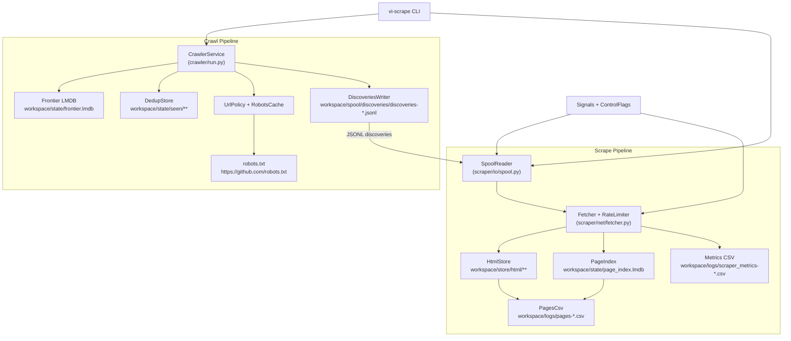
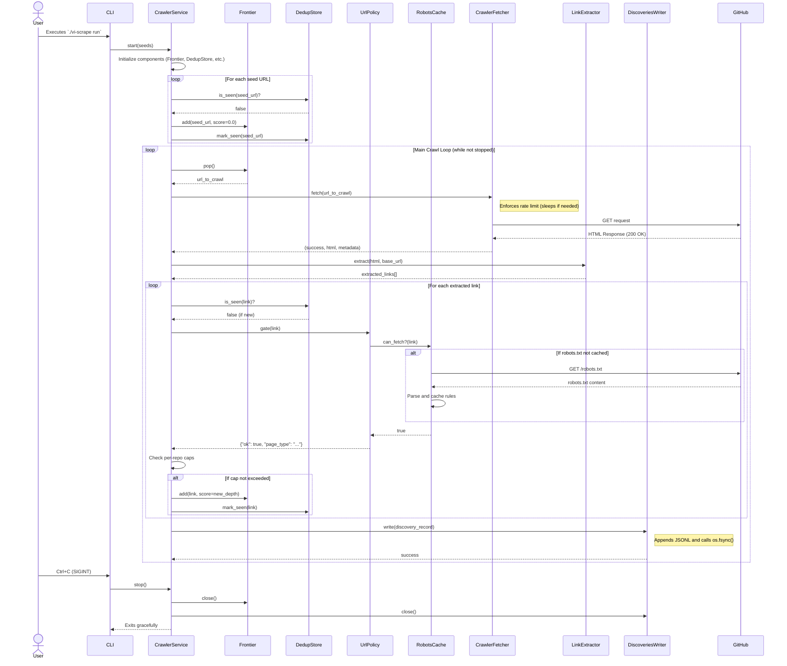
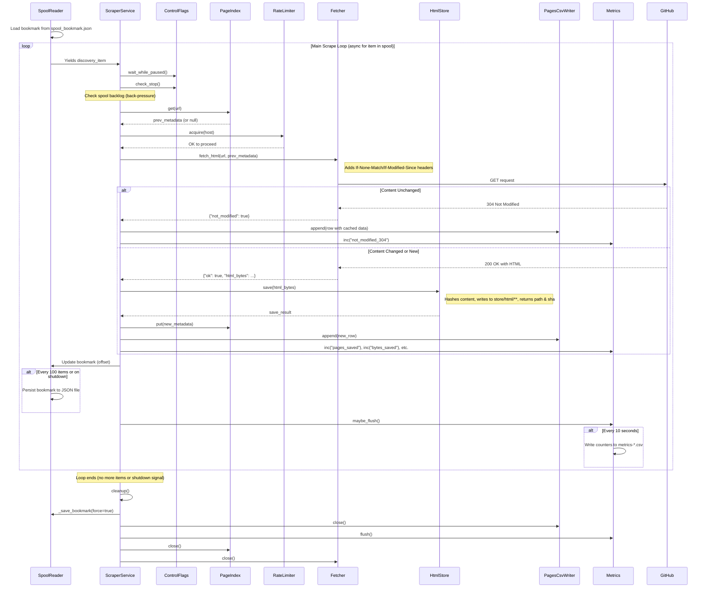

# Architecture Overview

This document describes the architecture of the GitHub-focused crawler and scraper pipeline hosted in this repository. It covers the runtime topology, main components, shared infrastructure, and the persistence layout that underpin the system.

## System Topology


## Runtime Overview

- The **crawler** explores GitHub URLs, enforces policy/robots rules, deduplicates work, and emits discovery records as JSONL segments into `workspace/spool/discoveries/`.
- The **scraper** tails those discovery files, fetches the referenced HTML, stores blobs in a content-addressed store, and logs metadata to CSV/LMDB for downstream processing.
- The `vi-scrape` helper CLI provisions the workspace and coordinates joint crawler + scraper runs for local operation.
- All configurable paths are derived from YAML configuration files (`config.yaml`, `config_run.yaml`, `scraper_config.yaml`), keeping storage under the `workspace/` tree.

## Core Components

### CrawlerService (`crawler/run.py`)

- **Configuration**: `crawler/config.py` hydrates `CrawlerConfig` from YAML, expanding workspace-relative paths and validating strict policy settings (only `github.com` is allowed; user agents must include contact info).
- **Frontier**: `crawler/frontier/frontier.py` implements a persistent priority queue atop LMDB. URLs are scored (depth-based) and popped in breadth-first order. Metadata keys keep a monotonic counter for stable ordering.
- **Deduplication**: `crawler/frontier/dedup.py` shards SHA-256 hashes into a two-level directory tree (`workspace/state/seen/aa/bb/<hash>.seen`) to mark processed URLs.
- **Policy Enforcement**: `crawler/policy.py` wraps compiled allow/deny regexes, strict host checks, and robots compliance. `RobotsCache` (`crawler/robots_cache.py`) fetches and caches `robots.txt`, denying access on errors to stay conservative.
- **Fetching**: `crawler/net/fetcher.py` uses `httpx.AsyncClient` with retries, exponential backoff, and request pacing (`limits.req_per_sec`). It returns HTML content and timing metadata.
- **Link Extraction**: `crawler/parse/extractor.py` leverages BeautifulSoup to collect GitHub anchors, converting relative links to absolute and filtering non-GitHub domains.
- **Discovery Output**: `crawler/io/discoveries.py` writes each processed page to `discoveries-<timestamp>.jsonl` and forces an `os.fsync()` so the scraper can tail reliably.
- **Caps & Metrics**: `CrawlerService` tracks per-repository quotas (issues, PRs, pages) and counters (fetch errors, policy denials) for statistics logging on shutdown.
- **CLI Entry point**: `crawler/__main__.py` exposes `run`, `validate-policy`, and `status` commands, wiring the service into an `asyncio` event loop.

> **Note:** Placeholders `crawler/io/metrics.py`, `crawler/io/trajectory.py`, `crawler/net/limiter.py`, and `crawler/net/proxy_client.py` exist for future extensions (metrics emission, crawl graph export, advanced rate limiting, proxy integration).

### ScraperService (`scraper/run.py`)

- **Configuration**: `scraper/config.py` loads `ScraperConfig`, ensures workspace-relative paths resolve, and prints compliance details. It also normalizes file permissions strings for the HTML store.
- **Spool Consumption**: `scraper/io/spool.py` maintains a bookmark (`workspace/state/spool_bookmark.json`) and iterates JSONL discoveries in file order, handling rotations and resume support. It persists the bookmark every 100 items (or on shutdown).
- **Rate Limiting**: `scraper/util/limits.py` enforces global concurrency and request spacing. Hosts are tracked individually for future host-specific throttling.
- **Fetching**: `scraper/net/fetcher.py` reuses a long-lived HTTP/2 client, supports proxy selection via `ProxyClient`, and performs conditional requests using stored `ETag`/`Last-Modified` data. It buckets HTTP responses into metrics categories and retries with exponential backoff plus jitter.
- **HTML Storage**: `scraper/io/storage.py` hashes responses, writes them to a two-level shard structure under `workspace/store/html/`, and optionally compresses content with the `zstandard` (`zstd`) codec. Deduplication avoids rewriting identical blobs.
- **Indexing**: `scraper/index/page_index.py` stores per-URL metadata in LMDB, enabling future conditional fetches and replay functionality.
- **CSV Logging**: `scraper/io/csv_writer.py` appends per-page rows to `workspace/logs/pages-<run>.csv`, encoding extra metadata as JSON strings within the CSV.
- **Metrics**: `scraper/io/metrics.py` aggregates counters (status code groups, fetched pages, byte totals) and flushes them to CSV at configurable intervals.
- **Control Plane**: `scraper/control/flags.py` watches `workspace/pause.scraper` and `workspace/stop.scraper` for external pause/stop signals. `scraper/util/signals.py` wires UNIX signals: SIGTERM/SIGINT trigger graceful shutdown, SIGHUP reloads configuration, and SIGUSR1 dumps status diagnostics.
- **Replay Support**: `ScraperService.replay()` rebuilds the pages CSV offline using index entries and stored HTML, useful for backfills.
- **CLI Entry point**: `scraper/__main__.py` offers `run`, `resume`, `replay`, and `status` commands, orchestrating signal setup and event loop execution.

### Orchestration & Tooling

- **`vi-scrape` CLI: Provides `run`, `configure`, and `reset` commands. `run` boots the crawler in the background and the scraper in the foreground, handling cleanup on exit. `configure` seeds workspace directories and default `seeds.txt`. `reset` wipes spool/store/logs/state after interactive confirmation.
- **Configuration Files**: `config.yaml` / `config_run.yaml` feed the crawler; `scraper_config.yaml` feeds the scraper. Paths are relative to the workspace folder referenced in each file. Both configs enforce user agent requirements and conservative defaults (1 request/sec, limited concurrency).
- **Workspace Layout**: Explained in README and `.github/copilot-instructions.md`. All runtime state lives under `workspace/` to simplify cleanup and packaging.

## Data Stores & Formats

| Store | Producer | Consumer | Format | Location |
|-------|----------|----------|--------|----------|
| Discovery Spool | `DiscoveriesWriter` | `SpoolReader` | JSONL (one discovery per line) | `workspace/spool/discoveries/` |
| Spool Bookmark | `SpoolReader` | `SpoolReader` | JSON (`{"file": str, "offset": int}`) | `workspace/state/spool_bookmark.json` |
| Frontier Queue | `Frontier` | `CrawlerService` | LMDB (score + counter keys) | `workspace/state/frontier.lmdb/` |
| Seen Store | `DedupStore` | `CrawlerService` | Touch files (`<sha>.seen`) | `workspace/state/seen/aa/bb/` |
| Page Index | `PageIndex` | `ScraperService` | LMDB JSON values | `workspace/state/page_index.lmdb/` |
| HTML Store | `HtmlStore` | Downstream tools | `sha256.html[.zst]` files | `workspace/store/html/aa/bb/` |
| Pages CSV | `PagesCsv` | Analysts / Replay | CSV with metadata columns | `workspace/logs/pages-<run>.csv` |
| Metrics CSV | `Metrics` (scraper) | Operators | CSV (`timestamp, metric, value`) | `workspace/logs/scraper_metrics-<run>.csv` |
| Crawler Metrics | (planned) | Operators | CSV | `workspace/logs/crawler_metrics.csv` |
| Trajectory Edges | (planned) | Graph tools | CSV | `workspace/logs/edges.csv` |

## Control & Resilience

- **Back-pressure**: Scraper enforces `spool.max_backlog_gb`; if spool size exceeds the threshold it sleeps before consuming further, allowing operators to intervene.
- **Graceful Shutdown**: Both services respond to SIGTERM/SIGINT. Scraper persists bookmarks and flushes metrics on exit; crawler closes LMDB handles and logs stats.
- **Policy Compliance**: Policy tests (`test_policy.py`) assert allow/deny contracts. Robots caching respects TTL and denies access on failures to avoid policy violations.
- **Error Handling**: Fetchers record retry counts and categorize HTTP errors. Scraper logs non-HTML content as `not_html` and keeps metrics for failed fetches.
- **Observability**: Metrics CSVs, status commands, and signal-triggered dumps expose internal counters. CLI `status` commands summarize spool sizes, stored HTML counts, and index statistics.

## Extensibility Notes

- Empty modules under `crawler/io/metrics.py`, `crawler/io/trajectory.py`, and `crawler/net/limiter.py` serve as stubs for richer telemetry and alternative limiting strategies.
- `scraper/net/proxy_client.py` defines an abstract interface; integrating with an external proxy manager only requires providing a concrete implementation.
- Frontier scoring is currently depth-based; custom prioritization (e.g., repo importance) can swap in by adjusting the `score` passed to `Frontier.add`.
- Replay mode demonstrates how downstream reprocessing can leverage the page index; additional offline pipelines can iterate index entries without touching live spool files.

## Testing & Contracts

- `pytest -q` runs the automated test suite. Focused tests cover policy enforcement, spool ordering/resume guarantees, fetcher behavior, storage/index invariants, and scraper integration.
- When modifying policy or storage layouts, update corresponding tests (`test_policy.py`, `test_storage.py`, `test_index.py`) and keep documentation (`README.md`, `SCRAPER_USER_GUIDE.md`) in sync.
- Bookmark semantics (`scraper/io/spool.py`) are critical: JSON structure and `os.fsync()` frequency maintain crash resilience. Any changes must preserve backward compatibility with existing bookmarks.

## Operational Summary

1. **Initialization**: `vi-scrape configure` prepares workspace directories and default seeds.
2. **Crawl Loop**: `CrawlerService` seeds the frontier, fetches pages respecting policy/robots, extracts links, enforces per-repo caps, and emits discoveries.
3. **Scrape Loop**: `ScraperService` tails spool files, rate-limits fetches, stores deduplicated HTML, updates indexes/CSV logs, and flushes metrics.
4. **Shutdown**: Signals or CLI stop requests ensure bookmark persistence and resource cleanup. Operators can replay stored content or resume from the last processed offset.

This architecture balances conservative GitHub crawling with durable storage and restartable scraping, providing clear extension points for richer metrics, proxy rotation, or advanced frontier management.

---

## Detailed Pipeline Descriptions

The following sections provide step-by-step walkthroughs of both the crawler and scraper pipelines, detailing the exact technologies, data formats, and code modules involved at each stage. These descriptions enable readers unfamiliar with the codebase to understand the complete data flow from seed URLs to stored HTML and metadata logs.

### Crawler Pipeline

The crawler pipeline discovers GitHub URLs, validates them against policy rules, extracts links from HTML, and emits structured discovery records for downstream consumption by the scraper.

#### Step 1: Configuration Loading

**Module**: `crawler/config.py`  
**Technology**: PyYAML (`yaml.safe_load`)

The crawler loads configuration from a YAML file (typically `config.yaml` or `config_run.yaml`). The `CrawlerConfig.from_yaml()` class method:

1. Parses the YAML structure into nested data class instances (`RobotsConfig`, `ScopeConfig`, `LimitsConfig`, `CapsConfig`, `FrontierConfig`, `SpoolConfig`, `MetricsConfig`, `TrajectoryConfig`).
2. Validates required fields (e.g., `user_agent` must include contact info like `+https://...`).
3. Expands workspace-relative paths to absolute paths (e.g., `workspace/state/frontier.lmdb` becomes `/absolute/path/workspace/state/frontier.lmdb`).
4. Prints a compliance banner showing the user agent and links to GitHub's robots.txt, acceptable use policies, and terms of service.

**Key validations**:
- Only `github.com` is allowed in `scope.allowed_hosts`.
- User agent must contain `+http` to include operator contact information.
- Rate limits (`req_per_sec`) must be positive; concurrency must be at least 1.

#### Step 2: Component Initialization

**Module**: `crawler/run.py` (`CrawlerService.__init__` and `CrawlerService.start`)  
**Technologies**: LMDB, SHA-256 hashing via Python `hashlib`, HTTP client library `httpx`, BeautifulSoup HTML parser, Python `asyncio`

When `CrawlerService.start(seeds)` is called, the following components are initialized:

1. **Frontier** (`crawler/frontier/frontier.py`):
   - Opens an LMDB database at `workspace/state/frontier.lmdb`.
   - LMDB settings: `map_size=10GB`, `writemap=True`, `sync=True` for durability.
   - Stores a monotonic counter in a metadata key `__meta:counter` (8-byte big-endian `uint64`).
   - Each URL is assigned a composite key: `struct.pack(">dQ", score, counter)` (16 bytes total: 8-byte `double` score + 8-byte `uint64` counter).
   - URLs are popped in lexicographic key order, effectively sorting by score (depth) and then insertion order.

2. **Seen Store** (`crawler/frontier/dedup.py`):
   - Uses Python `hashlib.sha256` to hash each URL.
   - Creates empty "touch files" at `workspace/state/seen/aa/bb/<sha256>.seen` (two-level directory partitioning).
   - Atomicity: creates temp file with `tempfile.mkstemp`, then `os.replace` to avoid race conditions.
   - `is_seen(url)` checks if the `.seen` file exists; `mark_seen(url)` creates it if missing.

3. **RobotsCache** (`crawler/robots_cache.py`):
   - Uses `httpx.AsyncClient` to fetch `https://github.com/robots.txt` with conservative timeouts (`connect=3s`, `read=5s`).
   - Parses robots.txt using Python's `urllib.robotparser.RobotFileParser`.
   - Caches parsed rules keyed by host, with TTL of 24 hours (configurable).
   - Returns `False` (deny) if fetch fails or parsing errors occur, ensuring conservative compliance.

4. **UrlPolicy** (`crawler/policy.py`):
   - Compiles allow/deny regex patterns from config using `re.compile()`.
   - Stores allowed hosts and denied subdomains in sets for O(1) lookups.
   - `policy.gate(url)` returns `{"ok": bool, "reason": str, "page_type": str}` after checking host, patterns, and robots.txt.

5. **CrawlerFetcher** (`crawler/net/fetcher.py`):
   - Creates `httpx.AsyncClient` with `Timeout` objects (connect, read, write from config).
   - Enables HTTP/2 (`http2=False` in current code), redirects up to 5 hops.
   - Rate limiting: uses `asyncio.Lock` and `time.time()` to enforce `1.0 / req_per_sec` minimum interval between requests.
   - Retry logic: exponential backoff `base_ms * (2 ** attempt)` capped at `backoff_cap_ms`.

6. **LinkExtractor** (`crawler/parse/extractor.py`):
   - Uses `BeautifulSoup(html, "html.parser")`.
   - `soup.find_all("a", href=True)` to locate anchor tags.
   - `urljoin(base_url, href)` converts relative links to absolute.
   - Filters: skips `javascript:`, `mailto:`, `tel:`, `#` anchors, and non-`github.com` domains.

7. **DiscoveriesWriter** (`crawler/io/discoveries.py`):
   - Opens `workspace/spool/discoveries/discoveries-<timestamp>.jsonl` in append mode.
   - Each discovery is written as a JSON object on one line: `json.dumps(item)`.
   - After writing, calls `fh.flush()` and `os.fsync(fh.fileno())` to ensure durability before returning.

#### Step 3: Seeding the Frontier

**Module**: `crawler/run.py` (`CrawlerService.start`)

Seed URLs (from `seeds.txt` or CLI args) are:

1. Canonicalized using `crawler/url_tools.py:canonicalize()`:
   - Lowercases scheme and host.
   - Removes query parameters (unless whitelisted, currently none allowed).
   - Removes fragment.
   - Normalizes path (removes trailing slash except for root, collapses `//` to `/`).
2. Checked against seen store: `if not dedup.is_seen(canonical)`.
3. Added to frontier: `frontier.add(canonical, score=0.0)` (depth 0 for seeds).
4. Marked as seen: `dedup.mark_seen(canonical)`.

**LMDB write**: The frontier increments its counter, packs `(0.0, counter)` into a 16-byte key, and stores `canonical.encode("utf-8")` as the value.

#### Step 4: Main Crawl Loop

**Module**: `crawler/run.py` (`CrawlerService.run`)  
**Control Flow**: `asyncio` event loop, `while not self._stop`

The main loop executes the following steps repeatedly:

1. **Check Frontier**: `if frontier.is_empty()`, sleep 5 seconds and retry.
2. **Pop URL**: `url = frontier.pop()` retrieves the lowest-score URL from LMDB and deletes that entry.
3. **Fetch Page**: `await fetcher.fetch(url)` returns `(success, html, metadata)`.
   - Enforces rate limit (sleeps if needed).
   - Sends GET request with headers: `User-Agent`, `Accept`, `Accept-Language`, `Accept-Encoding`.
   - Retries on 429 (rate limited), 5xx (server errors), timeouts, network errors.
   - Returns HTML as string on 200, or error metadata on failure.
4. **Classify Page**: `page_type = policy.classify(url)` matches URL against regex patterns:
   - `topic`: `/topics` or `/topics/<topic>`
   - `trending`: `/trending`
   - `repo_root`: `/<owner>/<repo>`
   - `blob`: `/<owner>/<repo>/blob/...`
   - `issues`: `/<owner>/<repo>/issues` or `/<owner>/<repo>/issues/<num>`
   - `pull`: `/<owner>/<repo>/pull` or `/<owner>/<repo>/pull/<num>`
5. **Extract Links**: `links = extractor.extract(html, url)` returns a list of absolute GitHub URLs.
6. **Enqueue Children**: For each extracted link:
   - Canonicalize.
   - Check seen store: `if dedup.is_seen(link)`, skip (increment `already_seen` stat).
   - Check policy: `policy_result = await policy.gate(link)`. If `policy_result["ok"] == False`, skip (increment `policy_denied` stat).
   - Check caps: If the link belongs to a repo, verify per-repo quotas (max pages, max issues, max PRs). If exceeded, skip (increment `cap_exceeded` stat).
   - Add to frontier: `frontier.add(link, score=float(child_depth))`.
   - Mark seen: `dedup.mark_seen(link)`.
7. **Emit Discovery**: Write a discovery record to JSONL:

```json
{
  "url": "https://github.com/owner/repo",
  "page_type": "repo_root",
  "depth": 1,
  "referrer": null,
  "metadata": {
    "status_code": 200,
    "content_length": 45123,
    "latency_ms": 234
  }
}
```

   The writer appends this line to the current JSONL file and calls `os.fsync()`.

8. **Rate Limit Sleep**: `await asyncio.sleep(1.0 / config.limits.req_per_sec)` to space out requests.

**Loop continues** until `self._stop` is set (SIGTERM/SIGINT signal or manual stop).

#### Step 5: Shutdown

**Module**: `crawler/run.py` (`CrawlerService.stop`)

On shutdown:

1. Sets `self._stop = True` to exit the main loop.
2. Waits briefly (`await asyncio.sleep(0.5)`) for loop to finish current iteration.
3. Closes frontier LMDB: `frontier.close()` calls `env.close()`.
4. Closes discoveries writer: `writer.close()` flushes and closes the file handle.
5. Logs final statistics: URLs fetched, links extracted, discoveries written, policy denials, duplicates, fetch errors, cap exceedances.
6. Logs fetcher stats: total requests, successes, failures, retries, bytes downloaded.

**Data Persistence Summary**:
- Frontier LMDB is synced on every transaction (`sync=True`).
- Seen store `.seen` files are created atomically.
- Discovery JSONL is synced via `os.fsync()` after each write.
- Bookmark is managed by the scraper (crawler does not use bookmarks).

---

### Scraper Pipeline

The scraper pipeline consumes discovery records from the spool, fetches the actual HTML content, stores it in a content-addressed store, maintains an index for conditional requests, and logs metadata to CSV files.

#### Step 1: Configuration Loading

**Module**: `scraper/config.py`  
**Technology**: PyYAML (`yaml.safe_load`)

The scraper loads configuration from `scraper_config.yaml`:

1. Parses nested config sections into data classes (`LimitsConfig`, `SpoolConfig`, `StoreConfig`, `PagesCsvConfig`, `MetricsConfig`, `IndexConfig`, `BookmarkConfig`).
2. Expands workspace-relative paths (e.g., `workspace/spool/discoveries` becomes absolute).
3. Replaces `{run_id}` placeholders in file paths (e.g., `pages-{run_id}.csv` becomes `pages-2025-01-09T15-30Z.csv`).
4. Converts permission strings like `"0o644"` to integers using `int(value, 0)`.
5. Prints compliance banner with user agent and policy links.

**Key validations**:
- `global_concurrency >= 1`, `req_per_sec > 0`.
- Spool `max_backlog_gb > 0`.
- Paths must be non-empty strings.

#### Step 2: Component Initialization

**Module**: `scraper/run.py` (`ScraperService.setup`)  
**Technologies**: LMDB, HTTP/2 client library `httpx`, `zstandard` compression, CSV, JSON, Python `asyncio`

When `ScraperService.setup()` is called, the following components are created:

1. **SpoolReader** (`scraper/io/spool.py`):
   - Loads bookmark from `workspace/state/spool_bookmark.json`: `{"file": "discoveries-123.jsonl", "offset": 4567}`.
   - If bookmark doesn't exist, initializes as `{"file": null, "offset": 0}`.
   - Polls `workspace/spool/discoveries/` every 0.5 seconds for JSONL files.
   - Sorts files by name (timestamp-based) to process in order.

2. **HtmlStore** (`scraper/io/storage.py`):
   - Uses Python `hashlib.sha256` to compute content hash.
   - Stores files at `workspace/store/html/<sha[:2]>/<sha[2:4]>/<sha>.html` (two-level directory partitioning).
   - Optional compression: `zstd.ZstdCompressor(level=10, threads=-1)` creates `.html.zst` files.
   - Atomic writes: creates temp file, writes, sets permissions, then `os.replace(tmp, final)`.
   - Deduplication: if file exists, returns `{"already_exists": True}` without rewriting.

3. **Pages CSV Writer** (`scraper/io/csv_writer.py`):
   - Opens `workspace/logs/pages-<run>.csv` in append mode using `csv.writer`.
   - Writes header row if file is new: `["timestamp", "url", "page_type", "depth", "referrer", "http_status", "content_type", "encoding", "content_sha256", "content_bytes", "stored_path", "etag", "last_modified", "fetch_latency_ms", "retries", "proxy_id", "metadata"]`.
   - Each row is flushed immediately: `self._file.flush()`.

4. **Metrics** (`scraper/io/metrics.py`):
   - Aggregates counters using `collections.Counter`.
   - Flushes to `workspace/logs/scraper_metrics-<run>.csv` every 10 seconds (configurable).
   - CSV format: `["timestamp", "metric", "value"]`, e.g., `1704804000, pages_fetched, 42`.

5. **PageIndex** (`scraper/index/page_index.py`):
   - Opens LMDB database at `workspace/state/page_index.lmdb`.
   - LMDB settings: `map_size=2GB`, `sync=True`, `metasync=True`.
   - Keys: URL strings encoded as UTF-8.
   - Values: JSON objects: `{"url": str, "sha256": str, "stored_path": str, "etag": str, "last_modified": str, "timestamp": int}`.
   - `get(url)` retrieves and parses JSON; `put(record)` serializes and stores.

6. **RateLimiter** (`scraper/util/limits.py`):
   - Uses `asyncio.Semaphore(global_concurrency)` to limit concurrent requests.
   - Token bucket: tracks `last_request_time`, enforces `min_interval = 1.0 / req_per_sec`.
   - `async with limiter.acquire(host)`: acquires semaphore, sleeps if needed, then yields.

7. **Fetcher** (`scraper/net/fetcher.py`):
   - Creates `httpx.AsyncClient` (HTTP/2 client) with `http2=True`, `Timeout(connect, read, write)` from config.
   - Supports conditional requests: adds `If-None-Match: <etag>` and `If-Modified-Since: <date>` headers if previous data exists.
   - Handles 304 Not Modified: returns `{"ok": True, "not_modified": True}` with cached metadata.
   - Retry logic: exponential backoff `base_ms * (2 ** attempt)` + jitter `* (0.75 + random.random() * 0.5)`.
   - Honors `Retry-After` header on 429 responses.

8. **ControlFlags** (`scraper/control/flags.py`):
   - Watches for `workspace/pause.scraper` and `workspace/stop.scraper` files.
   - `wait_while_paused()` polls every 1 second; sleeps if pause file exists.
   - `check_stop()` returns `True` if stop file exists.

9. **SignalHandler** (`scraper/util/signals.py`):
   - Registers handlers: SIGTERM/SIGINT set `shutdown_event`, SIGHUP calls reload callback, SIGUSR1 dumps status.

#### Step 3: Load Bookmark and Start Iteration

**Module**: `scraper/io/spool.py` (`SpoolReader.iter_items`)

The scraper:

1. Reads bookmark JSON to find starting file and byte offset.
2. Lists all `discoveries-*.jsonl` files in `workspace/spool/discoveries/`.
3. Sorts files by name to process in chronological order.
4. Locates the bookmark file in the sorted list (or starts at index 0 if not found).
5. Opens the file and seeks to the saved offset.
6. Enters an `async for` loop that yields discovery items.

#### Step 4: Main Scrape Loop

**Module**: `scraper/run.py` (`ScraperService.run`)  
**Control Flow**: `asyncio` event loop, `async for item in spool_reader.iter_items()`

For each discovery item:

1. **Parse Discovery**: `url = item["url"]`, `page_type = item["page_type"]`, `depth = item["depth"]`, `referrer = item["referrer"]`, `metadata = item.get("metadata", {})`.

2. **Check Control Flags**:
   - `await control_flags.wait_while_paused()`: blocks if `pause.scraper` exists.
   - `if await control_flags.check_stop()`: exits loop if `stop.scraper` exists.

3. **Check Back-pressure**:
   - `spool_size_gb = dir_size_gb(config.spool.dir)` recursively sums file sizes.
   - If `spool_size_gb > config.spool.max_backlog_gb`, sleeps 10 seconds and continues (skips this item temporarily).

4. **Lookup Previous Data**: `prev = page_index.get(url)` retrieves previous metadata (if any) for conditional requests.

5. **Fetch HTML**:
   - `async with limiter.acquire(host)`: acquires concurrency slot and enforces rate limit.
   - `result = await fetcher.fetch_html(url, prev)`:
     - Adds conditional headers if `prev` has `etag` or `last_modified`.
     - Sends GET request with headers: `User-Agent`, `Accept`, `Accept-Language`, `Accept-Encoding`, `Cache-Control: no-cache`.
     - Returns `{"ok": bool, "status": int, "html_bytes": bytes, "headers": dict, "latency_ms": float, "proxy_id": str, "not_modified": bool, "retries": int}`.

6. **Handle 304 Not Modified**:
   - If `result["not_modified"] == True`:
     - Uses cached `sha256`, `stored_path` from `prev`.
     - Writes CSV row with `content_bytes=0`, reusing previous data.
     - Increments `not_modified_304` metric.
     - Updates bookmark and continues.

7. **Handle 200 OK** (new content):
   - Extract `html_bytes` from result.
   - **Store HTML**:
     - `saved = html_store.save(html_bytes)`:
       - Computes `sha256 = hashlib.sha256(html_bytes).hexdigest()`.
       - Creates shard path: `workspace/store/html/aa/bb/<sha256>.html`.
       - If compression enabled: `compressor.compress(html_bytes)` and appends `.zst` extension.
       - Writes to temp file, sets permissions, `os.replace(tmp, final)`.
       - Returns `{"sha256": str, "stored_path": str, "bytes": int, "compressed_bytes": int, "compression_ratio": str, "already_exists": bool}`.
   - **Update Index**:
     - `page_index.put({"url": url, "sha256": sha256, "stored_path": stored_path, "etag": etag, "last_modified": last_modified, "timestamp": timestamp})`.
     - LMDB transaction writes JSON value to key `url.encode("utf-8")`.
   - **Write CSV Row**:
     - Assembles row dict with all 17 columns.
     - Serializes `metadata` dict to JSON string if present.
     - `pages_csv.append(row)` writes to CSV and flushes immediately.
   - **Update Metrics**:
     - `metrics.inc("pages_saved")`, `metrics.inc("bytes_saved", saved["bytes"])`, `metrics.inc("status_2xx")`.

8. **Handle Errors**:
   - If `result["ok"] == False`:
     - If `result["not_html"]`: increments `not_html` metric.
     - Else: increments `fetch_fail` metric and status bucket (e.g., `status_4xx`, `status_5xx`).
     - Logs error and continues without writing to store/index/CSV.

9. **Update Bookmark**:
   - After processing each item: `self.state["file"] = current_file.name`, `self.state["offset"] = current_fh.tell()`.
   - Every 100 items (or on shutdown): writes bookmark JSON atomically via temp file + `os.replace`.

10. **Flush Metrics**:
    - `metrics.maybe_flush()` checks if 10 seconds elapsed since last flush.
    - If yes, writes all counters to metrics CSV and resets `last_flush` timestamp.

11. **Progress Logging**:
    - Every 10 pages: prints `Progress: X pages processed` and metrics summary.

**Loop continues** until no more items, shutdown signal, or stop flag.

#### Step 5: Shutdown

**Module**: `scraper/run.py` (`ScraperService.cleanup`)

On shutdown:

1. Sets `self.running = False`.
2. Saves bookmark: `spool_reader._save_bookmark(force=True)`.
3. Closes pages CSV: `pages_csv.close()` flushes and closes file handle.
4. Flushes metrics: `metrics.flush()` writes all remaining counters to CSV.
5. Syncs and closes page index: `page_index.sync()`, `page_index.close()` ensures LMDB is flushed.
6. Closes fetcher: `await fetcher.close()` closes the HTTP/2 client.
7. Logs final statistics: runtime, pages processed, average time per page.

**Data Persistence Summary**:
- Bookmark is saved every 100 items and on shutdown (atomic JSON write).
- HTML store writes are atomic (temp + replace).
- Page index LMDB is synced on every transaction (`sync=True`).
- Pages CSV is flushed after every row.
- Metrics CSV is flushed every 10 seconds and on shutdown.

---

### Pipeline Integration Points

The crawler and scraper pipelines are loosely coupled via the discovery spool, enabling asynchronous operation and independent scaling.

#### Spool as Message Queue

- **Format**: JSONL (newline-delimited JSON) in `workspace/spool/discoveries/`.
- **Rotation**: Crawler creates new files with timestamps (`discoveries-<unix_timestamp>.jsonl`).
- **Ordering**: Scraper sorts files by name to process chronologically.
- **Durability**: Crawler calls `os.fsync()` after each write; scraper maintains bookmark for crash recovery.
- **Back-pressure**: Scraper monitors spool directory size; if it exceeds `max_backlog_gb`, it pauses consumption.

#### Deduplication Layers

1. **Crawler Seen Store**: SHA-256 hash of canonical URL -> `.seen` touch file prevents re-crawling.
2. **Scraper Dedup**: SHA-256 hash of HTML content -> content-addressed storage prevents storing duplicates.
3. **Index Dedup**: Page index tracks URLs; conditional requests (304 Not Modified) avoid re-downloading unchanged content.

#### Conditional Requests Flow

1. Crawler discovers URL, writes discovery to spool.
2. Scraper fetches URL, stores HTML, records `etag` and `last_modified` in index.
3. Crawler re-discovers same URL later (policy allows).
4. Scraper looks up URL in index, finds previous `etag`.
5. Scraper sends `If-None-Match: <etag>` header.
6. GitHub returns `304 Not Modified`.
7. Scraper writes CSV row with cached `sha256`/`stored_path`, saves bandwidth and storage.

#### Metrics and Observability

- **Crawler Metrics**: In-memory counters logged on shutdown (URLs fetched, links extracted, policy denials, dedup hits).
- **Scraper Metrics**: Aggregated counters flushed to CSV every 10 seconds (status codes, bytes saved, retries, not-modified).
- **CSV Logs**: `pages-*.csv` provides per-URL audit trail with timestamps, status codes, sizes, latencies.
- **Status Commands**: `python -m crawler status` and `python -m scraper status` dump current state (frontier size, spool files, stored HTML count, index size).
- **Signal Dumps**: SIGUSR1 triggers real-time status dump to console for debugging.

#### Error Handling and Retries

- **Network Errors**: Both fetchers retry with exponential backoff (base 500ms, cap 8000ms) plus jitter.
- **Rate Limiting**: 429 responses trigger backoff; `Retry-After` header is honored if present.
- **Policy Errors**: Denied URLs are logged but not retried (policy is deterministic).
- **Storage Errors**: Atomic writes ensure partial files are not visible; temp files are cleaned up on exceptions.
- **Bookmark Corruption**: If bookmark file is invalid JSON, scraper starts from first spool file.

#### Concurrency Model

- **Crawler**: Single async task per service instance; processes one URL at a time sequentially (rate limited).
- **Scraper**: Global semaphore limits concurrent fetches (default 2); rate limiter enforces request spacing (default 1 req/sec).
- **Async I/O**: Both use `asyncio` for non-blocking HTTP requests and sleep operations.
- **Blocking I/O**: LMDB operations, file writes, and SHA-256 hashing run in the main thread (acceptably fast for the workload).

#### Replay and Reprocessing

- **Replay Mode**: `python -m scraper replay --config scraper_config.yaml` rebuilds `pages-*.csv` from index and stored HTML without network access.
- **Use Cases**: Backfill missing CSV columns, regenerate logs after index corruption, audit stored content.
- **Limitations**: Page type, depth, and referrer are not stored in the index, so replay CSV rows have empty values for those fields.

#### Workspace Cleanup and Reset

- **`vi-scrape reset`**: Deletes spool files, stored HTML, LMDB databases, CSV logs, and bookmarks after user confirmation.
- **Preserves**: Directory structure (`workspace/spool/`, `workspace/store/`, etc.) for quick restart.
- **Idempotence**: Can be run multiple times; `configure` command recreates missing directories and default seeds.

---

## UML Sequence Diagrams

The following Mermaid sequence diagrams illustrate the detailed, step-by-step interactions within the crawler and scraper pipelines.

### Crawler Sequence Diagram

This diagram shows the process from initialization to writing a discovery, including policy checks, fetching, and link extraction.



### Scraper Sequence Diagram

This diagram illustrates how the scraper consumes discoveries, fetches content conditionally, stores it, and logs metadata.


