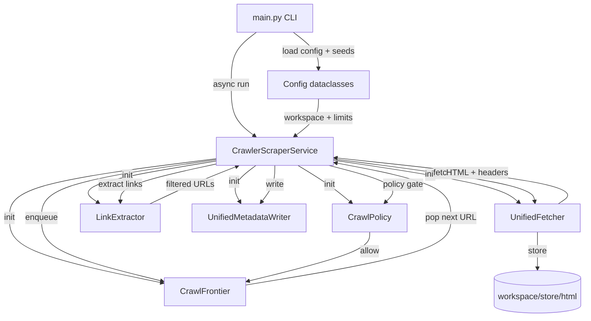

# 1. Odovzdanie – Report k 31. 10. 2025

## 1.1 Cieľ projektu
- **Problémová doména**: zhromaždiť a normalizovať dáta z GitHubu (repozitáre, topics, issues, pull requesty) so zameraním na výučbové Q&A scenáre pre wiki FIIT STU, pričom sa musí dodržať etické crawlovanie (robots.txt, user agent s kontaktom, nízky rate).
- **Výsledok**: plnohodnotná pipeline _crawl → extrakcia → index → vyhľadávanie_ umožňujúca:
  - persistenciu HTML a metadát v `workspace/`,
  - text/entitnú extrakciu (TSV, README, preprocessed texty),
  - tvorbu ľahkého invertovaného indexu s viacnásobnými IDF metódami,
  - odpovede na otázky o popularite, licencovaní, dokumentácii a vývoji open-source projektov.

## 1.2 Zdrojové stránky a extrahované dáta
| URL / doména | Popis obsahu | Extrahované atribúty (min. 5 ukážok) | Poznámky |
| --- | --- | --- | --- |
| https://github.com/python/cpython | Repozitár CPythonu (root) | - `STAR_COUNT: 69 369`<br>- `FORK_COUNT: 33 101`<br>- `LICENSE link: /python/cpython/blob/main/LICENSE`<br>- `README_SECTION: "This is Python version 3.15.0..."`<br>- `VERSION: 3.15.0` | doc_id `d44f9b6…`; `page_type=repo_root`; HTML uložené v `workspace/store/html/d4/4f/...`; entity v `workspace/store/entities/entities.tsv`. |
| https://github.com/torvalds/linux | Repozitár Linux kernelu | - `STAR_COUNT: 205 018`<br>- `FORK_COUNT: 57 875`<br>- `LICENSE link: /torvalds/linux/tree/master/LICENSES`<br>- `README_SECTION: "Linux kernel There are several guides..."`<br>- `URL: https://www.kernel.org/doc/html/latest/` | doc_id `df769559…`; repo snapshot v `workspace/store/html/df/76/...`; entitné záznamy v TSV. |
| https://github.com/tensorflow/tensorflow | TensorFlow – machine learning platform | - `STAR_COUNT: 192 060`<br>- `FORK_COUNT: 74 912`<br>- `LICENSE: Apache-2.0`<br>- `VERSION: 2.20.0`<br>- `EMAIL: announce@tensorflow.org` | doc_id `44d90d0e…`; HTML uložené v `workspace/store/html/44/d9/...`; entity v `workspace/store/entities/entities.tsv`. |
| https://github.com/kubernetes/kubernetes | Kubernetes – container orchestration | - `STAR_COUNT: 118 008`<br>- `FORK_COUNT: 41 525`<br>- `LICENSE: Apache-2.0`<br>- `VERSION: 1.34.1`<br>- `README_SECTION: "Kubernetes (K8s) ... open source system for managing containerized applications"` | doc_id `8b452ba3…`; `page_type=repo_root`; dáta v `workspace/store/html/8b/45/...` a TSV. |
| https://github.com/facebook/react | React – UI library | - `STAR_COUNT: 239 805`<br>- `FORK_COUNT: 49 593`<br>- `LICENSE: MIT`<br>- `VERSION: 19.2.0`<br>- `README_SECTION: "React is a JavaScript library for building user interfaces"` | doc_id `d5025a1…`; uložené v `workspace/store/html/d5/02/...`; entitné záznamy dostupné v TSV. |
| https://github.com/nodejs/node | Node.js runtime | - `STAR_COUNT: 113 797`<br>- `FORK_COUNT: 33 490`<br>- `LICENSE: MIT`<br>- `VERSION: 22.0.0`<br>- `EMAIL: duhamelantoine1995@gmail.com` | doc_id `8c9f250c…`; HTML v `workspace/store/html/8c/9f/...`; entitné výstupy v `workspace/store/entities/entities.tsv`. |

_(Ukážky pochádzajú z Task 3: extrakcia entít a textov – viď `workspace/store/entities/entities.tsv`, `workspace/store/text[-preprocessed]`)._

## 1.3 Q&A scenáre
- **Scenár 1**: „Koľko hviezdičiek má python/cpython?“ → 69 369 hviezdičiek, 33 101 forkov (`STAR_COUNT`, `FORK_COUNT` v doc `d44f9b6…`).
- **Scenár 2**: „Aké témy sa spájajú so SQLModel projektmi?“ → `react`, `python`, `docker`, `sqlmodel`, `typescript`, `fastapi`, `pydantic`, `postgresql`, `mlops`, `ai-agents` (TOPIC entity v doc `0002297e…`).
- **Scenár 3**: „Aké správanie AST konštruktorov sa mení v issue #140196?“ → Od Pythonu 3.13 meníme defaulty (`optional` → `None`, `list` → `[]`, `expr_context` → `Load()`); text extrahovaný v doc `83ee85e7…`.
- **Scenár 4**: „Kde nájdem licenčné informácie pre torvalds/linux?“ → Sidebar link `LICENSES/` + README sekcia `Copyright and License Information` (`LICENSE` entity v doc `df769559…`).
- **Scenár 5**: „Koľko topic dokumentov máme oproti repo rootom?“ → Topics: 14 085; repo root: 9 465 (page-type breakdown v `docs/generated/crawl_stats.md`).
- **Scenár 6**: „Ktorý user agent použil crawler pri topic/sqlmodel?“ → `Mozilla/5.0 (Windows NT 6.1; Win64; x64; rv:47.0)` (metadáta doc `0002297e…` v `crawl_metadata.jsonl`).
- **Scenár 7**: „Ako rýchlo odpovedal server pri python/cpython?“ → Latencia 863.3 ms, 381.76 KB HTML (`crawl_metadata.jsonl`, doc `d44f9b6…`).

## 1.4 Použité technológie
| Vrstva | Nástroj / knižnica | Odôvodnenie |
| --- | --- | --- |
| Crawler | `asyncio`, `httpx`, `yaml`, `json`, `hashlib` | Asynchrónne HTTP/2 volania s retry/backoff, načítanie YAML konfigurácie, perzistentné JSONL metadáta, SHA-256 adresovanie HTML (`crawler/unified_fetcher.py`, `crawler/service.py`). |
| Politika a odkazy | `re`, `urllib.parse`, `html` | Regex extraktor na `<a>` tagy, canonicalizácia a filtrácia URL, entity unescape (`crawler/extractor.py`, `crawler/url_tools.py`). |
| Extraktor | Vlastné moduly (`extractor/html_clean.py`, `extractor/entity_extractors.py`, `extractor/io_utils.py`) – čisto standard library (`re`, `json`, `html`) | Regex-only čistenie GitHub UI, tvorba TSV cez `TSVWriter`, deduplikácia entít, samostatné spracovanie README. |
| Indexer | Balík `indexer` (`argparse`, `math`, `json`, `Pathlib`) | Index build/query/compare s TF výpočtom, viacerými IDF tabuľkami, JSONL zápisom (`indexer/build.py`, `indexer/search.py`, `indexer/compare.py`). |
| Reporting & analýza | `tools/crawl_stats.py` (štandardná knižnica) | Generuje Markdown/CSV štatistiky (počty dokumentov, page-type breakdown, runtime, statusy). |
| Testovanie | `unittest` | `tests/test_link_extractor.py`, `tests/test_html_text_extractor.py`, `tests/test_crawler_service.py`, `tests/smoke_test.py` overujú extraktory a crawler orchestráciu. |

## 1.5 Architektúra
- **Diagram**:

- **Popis pipeline**:
  - `main.py` → načíta `config.yaml`, `seeds.txt`, spúšťa `CrawlerScraperService`.
  - Služba inicializuje frontier (disk-backed queue), fetcher, policy, metadata writer a link extractor (BFS).
  - Každý URL: fetch + ukladanie HTML (content-addressed), zapisovanie metadát (HTTP status, veľkosť, UA, latencia).
  - Extrahované odkazy prechádzajú cez `CrawlPolicy` (allowlist, robots.txt cache, deny patterns, per-repo caps).
  - Periodické per-request a batch spánky regulujú tempo; frontier a štatistiky sa zapisujú každých 60 s.
  - Downstream: `python -m extractor` -> text/README/entity TSV, `python -m indexer.build` -> invertovaný index, `python -m indexer.query/compare` -> vyhľadávanie/analýza.

## 1.6 Metadáta pri crawlovaní
| Dokument | URL | HTTP stav | Page type | Veľkosť | Ďalšie meta |
| --- | --- | --- | --- | --- | --- |
| `d44f9b6b7bf81bd8cd7b8b7fb0fb9a06316fd11ddb0d1e2fc9cd0967e0a4ada5` | https://github.com/python/cpython | 200 | repo_root | 381.76 KB | Latencia 863.3 ms, UA `ResearchCrawlerBotVINF/2.0 (+mailto:xvysnya@stuba.sk)`, uložené v `workspace/store/html/d4/4f/...html`. |
| `df76955945858d1597325eef7ee46d4f02ff2c11bc260806ccfec4c9aa79272d` | https://github.com/torvalds/linux | 200 | repo_root | 305.07 KB | Latencia 646.7 ms, UA `ResearchCrawlerBotVINF/2.0 (+mailto:xvysnya@stuba.sk)`, hash `df769559…`. |
| `0002297ed0450b8dbb47cfd695075755b36ce04247e6e47aa6482dbb5018790b` | https://github.com/topics/sqlmodel | 200 | topic | 491.03 KB | Latencia 1120.3 ms, UA `Mozilla/5.0 … Firefox/47.0`, rad `workspace/store/html/00/02/...html`. |
| `83ee85e79784532a27bbfc8b7c363a2f576b0d44a6c3705223534c4913030e36` | https://github.com/python/cpython/issues/140196 | 200 | issues | 236.94 KB | Latencia 708.5 ms, UA rotácia `ResearchCrawlerBotVINF/2.0`, issue text v preprocessed výstupe. |

## 1.7 Hlavičky, timeouty, sleep
- **Zhrnutie**:
  - `user_agents`: rotácia troch hodnôt (vlastný s kontaktom + dve Firefox UA) – `config.yaml` (`user_agent_rotation_size=3`).
  - `Accept-Language: en`, `Accept-Encoding: br, gzip`, `Connection: keep-alive`.
  - Časové limity: `connect_timeout=4000 ms`, `read_timeout=15000 ms`, `total_timeout=25000 ms`.
  - Rate limit: `req_per_sec=1.0`, `global_concurrency=4`, `per_host_concurrency=2`.
  - Spánky: per-request 3–5 s, batch 10–20 s po 50 požiadavkách (človeku podobné pacing).
- **Odôvodnenie**:
  - Vlastný UA s e-mailom spĺňa GitHub guidelines; rotácia znižuje riziko blokovania.
  - Nízky request rate + spánky minimalizujú záťaž; timeouts zabraňujú zaveseniu spojení.
  - Roboty: `scope.robots` s TTL 24 h, compliance loguje `CrawlPolicy` (priebežné `robots_cache.jsonl`).

## 1.8 Ukážka kódu – extrakcia URL z HTML
```python
# crawler/extractor.py:10
class LinkExtractor:
    
    def extract(self, html_content: str, base_url: str) -> List[str]:
        if not html_content or not base_url:
            return []
        
        try:
            pattern = r"""<a\s+[^>]*?href\s*=\s*(?:["']([^"']+)["']|([^\s>]+))"""
            seen = set()
            results = []
            
            for match in re.finditer(pattern, html_content, re.IGNORECASE | re.DOTALL):
                href = match.group(1) or match.group(2)
                href = html.unescape(href).strip()
                
                if not href or href.startswith("#") or href.startswith("javascript:"):
                    continue
                if href.startswith("mailto:") or href.startswith("tel:"):
                    continue
                absolute_url = urljoin(base_url, href)
                if not self._is_supported_scheme(absolute_url):
                    continue

                url_without_fragment = self._remove_fragment(absolute_url)
                if url_without_fragment not in seen:
                    seen.add(url_without_fragment)
                    results.append(url_without_fragment)
            
            logger.debug(f"Extracted {len(results)} links from {base_url}")
            return results
            
        except Exception as e:
            logger.error(f"Error extracting links from {base_url}: {e}")
            return []
```

## 1.9 Ukážka kódu – extrakcia entít
```python
# extractor/entity_extractors.py:432
def extract_urls(doc_id: str, html_content: str, text_content: str) -> List[EntityRow]:
    """Extract URLs from HTML and text."""
    results = []
    seen = set()
    url_patterns = regexes.get_url_regexes()

    # HTTP URLs z HTML
    for match in url_patterns['http'].finditer(html_content):
        url = match.group(0).strip()
        if url and url not in seen:
            offsets = [{'start': match.start(), 'end': match.end(), 'source': 'html'}]
            results.append((doc_id, 'URL', url, json.dumps(offsets, separators=(',', ':'))))
            seen.add(url)

    # Markdown linky z textu
    for match in url_patterns['markdown'].finditer(text_content):
        url = match.group(2).strip()
        if url and url not in seen:
            offsets = [{'start': match.start(), 'end': match.end(), 'source': 'text'}]
            results.append((doc_id, 'URL', url, json.dumps(offsets, separators=(',', ':'))))
            seen.add(url)

    return results
```
_(Zdroják referencovaný na wiki: `crawler/extractor.py`, `extractor/entity_extractors.py`.)_

## 1.10 Indexer a index
- **Popis TF výpočtu**: `indexer/ingest.py` vytvára `term_freq` (raw counts), scoring v `indexer/search.py` používa `tf_weight = 1 + log(tf)` a rovnako pre query (`1 + log(q_tf)`).
- **Interval rebuildov**: po každom väčšom behu extraktora sa spúšťa `python -m indexer.build --input workspace/store/text --output workspace/store/index/dev` (cca denne pri experimentoch); RSJ aj log IDF sa ukladajú v `postings.jsonl`.
- **Štruktúra uloženia**:
  - `workspace/store/index/default/docs.jsonl` – doc table (`doc_id`, `path`, `title`, `length`, voliteľné `tiktoken_token_count`).
  - `postings.jsonl` – záznamy: `term`, `df`, `idf` (mapa metód), `postings` (zoznam `{doc_id, tf}`).
  - `manifest.json` – `total_docs`, `total_terms`, `idf_method`, `idf_methods`.
- **CLI**: `python -m indexer.build`, `python -m indexer.query`, `python -m indexer.compare`. Token counts dostupné voliteľne (`--use-tokens`, závisí na `tiktoken`).
- **Poznámka**: Tokenizácia (`indexer/tokenize.py`) používa regex `[A-Za-z0-9]+`, nižšia podpora pre ne-ASCII – ak bude potrebné, rozšírime v ďalšom milestone.

## 1.11 Metódy IDF
| Metóda | Vzorec | Implementačné poznámky |
| --- | --- | --- |
| IDF Log | `log((N + 1)/(df + 1)) + 1` | `indexer/build.py:34` (`compute_idf`) – kladné skóre aj pri `df=N`. |
| IDF RSJ | `log((N - df + 0.5)/(df + 0.5))` | `indexer/build.py:41` – numerator/denominator clampnutý na ≥0.5, kompatibilné s probabilistic retrieval. |

## 1.12 Porovnanie IDF metód (min. 3 dopyty)
| Query | Top výsledky (Log) | Top výsledky (RSJ) | Pozorovania |
| --- | --- | --- | --- |
| `github crawler` | 1. `14558` (27.8478, „`:root {`“)<br>2. `6827` (26.8188)<br>3. `650` (26.6225)<br>4. `18808` (25.0612)<br>5. `7529` (24.5381) | 1. `14558` (-11.3665)<br>2. `6827` (-12.1840)<br>3. `650` (-12.9229)<br>4. `25240` (-13.9471, „Explore“)<br>5. `5984` (-14.0955) | RSJ penalizuje frekventované CSS dokumenty, pridáva `doc 25240`; top-3 zhodné. |
| `async http client` | `1146`, `7875`, `24045`, `13708`, `9958` (skóre 46.59 → 38.67) | Rovnaká päťka (skóre 28.88 → 24.38) | Stabilný dopyt – špecifické termy, RSJ = log. |
| `repository metadata` | `27565`, `20164`, `11332`, `14108`, `12824` | `11332`, `14108`, `20164`, `27565`, `26051` | RSJ mení celé poradie a pridáva `26051` – lepšie oddeľuje frekventované výrazy. |
| `python release schedule` | `8704`, `9033`, `14066`, `11991`, `17254` | `14066`, `8704`, `9033`, `11991`, `26051` | RSJ uprednostní dokument s explicitnou sekciou „Release Schedule“; log preferuje kombináciu README a issue. |
_(Zdroj: `docs/generated/index_comparison.md` – generované `python -m indexer.compare --top 5`.)_

## 1.13 Štatistika dokumentov
| Metrika | Hodnota | Zdroj |
| --- | --- | --- |
| Počet HTML (celkom) | 28 647 | `docs/generated/crawl_stats.md` (Total documents) |
| Úspešné HTML (2xx) | 28 353 | `docs/generated/crawl_stats.md` (Successful) |
| Celková veľkosť HTML | 10.02 GB (10 753 802 579 bajtov) | `docs/generated/crawl_stats.md` |
| Počet topics | 14 085 (49.17 %) | `docs/generated/crawl_stats.md` |
| Počet repo root | 9 465 (33.04 %) | `docs/generated/crawl_stats.md` |
| Počet issues | 5 066 (17.68 %) | `docs/generated/crawl_stats.md` |
| `urls_fetched` / `urls_enqueued` | 28 351 / 573 308 | `workspace/state/service_stats.json` |
| `policy_denied` | 2 934 093 | `workspace/state/service_stats.json` (silná filtrácia allowlistom/deny patterns) |
| `links_extracted` | 6 674 353 | `workspace/state/service_stats.json` |
| Runtime | 296 h 39 m 44 s (akumulovaný) | `docs/generated/crawl_stats.md` (Service stats snapshot) |
| Relevantných dokumentov | 14 405 (~50.3 %, `repo_root+issues+pull`) | `docs/generated/crawl_stats.md`, parameter `--relevant-page-types` |

## 1.14 Prílohy
- **Zdrojový kód**: celý repozitár (crawler, extractor, indexer, tools, konfigurácia).
- **Dáta**: `workspace/` obsahuje HTML store, metadata JSONL, text/README výstupy, TSV entít, index.
- **Generované reporty**: `docs/generated/crawl_stats.md` & `.csv`, `docs/generated/index_comparison.md`.
- **Unit testy**: `tests/test_link_extractor.py`, `tests/test_html_text_extractor.py`, `tests/test_crawler_service.py`, `tests/smoke_test.py` (regex coverage budeme rozširovať).
- **Token counts (tiktoken)**: pipeline pripravený (`indexer.build --use-tokens`), no nespustené kvôli výkonu – viď README.
- **ZIP balíček**: podľa pôvodného návrhu `zip -r submission.zip crawler extractor indexer tools docs config.yaml main.py requirements.txt workspace/store/entities/entities.tsv docs/generated`.
- **Reprodukcia**: `README.md` → príkazy na aktiváciu venv, crawl, extrakciu, index build, testy.

---
_Späť: [2. Konzultácia](./konzultacia-2) · Ďalej: [3. Konzultácia](./konzultacia-3)_ (odkazy na wiki sa doplnia pri publikovaní).
