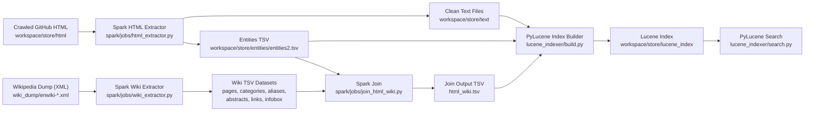

====== Odovzdanie 2 ======


**Note:** Some evaluation metrics and comparison queries (especially the Google/GitHub vs. our search comparison) were not performed due to storage limitations during runs, which prevented extracting and persisting all required datasets and appropriate evaluation artifacts.

---

====== 0. Executive Summary ======

This phase extends the Phase 1 pipeline (crawler → extractor → TF‑IDF index) into a distributed, big‑data‑capable workflow using Apache Spark DataFrame jobs. The main additions are:

- Spark HTML extractor ported from the Phase 1 extractor to process 28k+ crawled GitHub pages in parallel and produce text + entities.
- Spark Wikipedia dump extractor that parses a 111 GB English Wikipedia XML dump and outputs structured TSV datasets (pages, categories, links, infoboxes, abstracts, aliases).
- Spark join job that links extracted GitHub entities to canonical Wikipedia pages (direct, redirect, alias matches), producing enriched join outputs.
- A new PyLucene index schema and builder that adds entity and Wikipedia enrichment fields, plus a search engine supporting multiple query types.

Key join statistics from a full run:

- **Unique Wikipedia pages joined:** **11,080**
- **Matched entities:** 1,744,493 out of 12,797,272 (**13.63% match rate**)
- **Documents with at least one wiki match:** 28,346 (≈ all crawled documents)

Comparison with Google / GitHub search is **NOT IMPLEMENTED** in this phase.

---

====== 1. Distributed Processing Architecture (Apache Spark) ======

====== 1.1 Transition from Phase 1 to Spark ======

Phase 1 implemented a local (single‑machine) pipeline:

1. **Crawler** collected GitHub pages into `workspace/store/html/`.
2. **Extractor** cleaned HTML and extracted entities into local TSV/text outputs.
3. **Indexer** built a TF‑IDF based inverted index and offered simple keyword search.

Phase 2 keeps the same data sources and extraction logic, but **re‑implements the heavy stages as Spark DataFrame jobs**:

- The Phase 1 HTML cleaning and regex/entity logic was moved into `spark/lib/extractor/` and invoked by `spark/jobs/html_extractor.py`.
- All processing runs through `bin/cli`, which orchestrates Docker Compose services (`spark-extract`, `spark-wiki`, `spark-join`, `lucene-build`, `lucene-search`, `lucene-compare`).
- The Spark jobs avoid legacy RDD workflows; they use DataFrames, UDFs only where necessary (XML/wikitext parsing), partition‑aware `mapPartitions`, disk‑first persistence, and adaptive execution.

====== 1.2 Pipeline Overview ======



====== 1.3 Spark Runtime & Big‑Data Design Notes ======

- Spark 3.4 (driver/executor memory configurable via env vars in `bin/cli`/Compose).
- Large intermediate DataFrames are persisted with `DISK_ONLY` to avoid executor OOM.
- Output is written in parallel into partitioned parts and optionally merged, instead of forcing a single partition (in line with Spark SQL tuning guidance on avoiding `coalesce(1)` bottlenecks).

---

====== 2. Wikipedia Dump Processing ======

====== 2.1 Extraction Approach ======

The job `spark/jobs/wiki_extractor.py` processes Wikipedia XML dumps as a streaming DataFrame pipeline:

1. **Read dump as DataFrame of lines** using `spark.read.text()`.
2. **Page boundary extraction per partition** via `mapPartitions`, yielding `<page>...</page>` blocks without materializing full XML in memory.
3. **UDF‑based parsing** of each page’s XML and wikitext:
   - `extract_page_xml` → page metadata and raw text.
   - `normalize_title` → canonical title key for joins.
   - `extract_categories`, `extract_internal_links`, `extract_infobox_fields`, `extract_abstract`.
   - `clean_wikitext_to_plaintext` (only if full text extraction enabled).
4. **Persist parsed pages with `DISK_ONLY`**, so the expensive XML UDF runs once and feeds multiple output DataFrames.
5. **Write six structured TSV datasets**:
   - `pages.tsv`: `page_id, title, norm_title, ns, redirect_to, timestamp`
   - `categories.tsv`: `(page_id, category, norm_category)`
   - `links.tsv`: `(page_id, link_title, norm_link_title)`
   - `infobox.tsv`: `(page_id, key, value)`
   - `abstract.tsv`: `(page_id, abstract_text)` (sanitized to single‑line TSV)
   - `aliases.tsv`: `(alias_norm_title, canonical_norm_title)` from redirects
   - Optional `text_metadata.tsv` and plaintext files are supported but were disabled in the full run.

====== 2.2 Cleaning & Normalization ======

- Titles and categories are normalized to lower‑case, ASCII, punctuation‑free keys to improve join stability.
- Abstracts are sanitized to single‑line text (tabs/newlines removed, whitespace collapsed).
- Redirects are captured as aliases to increase coverage.

====== 2.3 Run Statistics (Performed) ======

From the full extraction manifest (`runs/20251211_213717/manifest.json`):

- **Input dump:** `enwiki-20250901-pages-articles-multistream.xml` (111.46 GB)
- **Pages extracted:** 3,107,596 (mainspace + redirects)
- **Max pages limit:** 4,000,000
- **Partitions:** 512
- **Driver memory:** 14 GB
- **Duration:** 1,608.68 s (~26.8 min)
- **Outputs:** 6 TSV datasets written under `workspace/store/spark/wiki/`

---

====== 3. Data Integration (The Join) ======

====== 3.1 Why and What We Join ======

The goal is to **enrich GitHub repository data with authoritative Wikipedia knowledge**:

- GitHub entities (topics, URLs, licenses, languages) are noisy and short.
- Wikipedia provides canonical names, semantic categories, and textual context (abstracts).

Enrichment enables:

- Better disambiguation (e.g., “Go” language vs unrelated meanings).
- Semantic filtering by Wikipedia categories.
- Search over both domain text and Wikipedia concepts.

====== 3.2 Join Logic ======

Implemented in `spark/jobs/join_html_wiki.py` using pure DataFrame API:

1. **Load GitHub entities** from `entities2.tsv` and keep only supported types:
   - `TOPICS`
   - `LICENSE`
   - `LANG_STATS` (supported in code)
   - `URL`
   - `README` (supported in code, but produced no matches in runs)
2. **Normalize entity values** per type:
   - Lowercase, strip punctuation/diacritics.
   - Apply type‑specific mappings (e.g., license shorthands “apache-2.0” → “Apache License 2.0”; “js” → “JavaScript”).
3. **Build canonical Wikipedia mapping**:
   - Start from `pages.tsv` (mainspace, plus redirects).
   - Add `aliases.tsv` (redirect targets).
   - Treat redirects as aliases to boost coverage.
   - Deduplicate with priority: direct > redirect > alias.
   - Compute a **compact normalization key** to avoid collisions like “type script” vs “typescript”.
4. **Left join entities to canonical wiki mapping** by normalized key/compact key.
5. **Optional enrichment**:
   - Aggregate categories per page.
   - Mark “relevant categories” by regex (`programming|language|license|software|technology|framework|library|computer`).
   - Join in abstract text.
6. **Compute confidence label**:
   - `exact`, `redirect`, `alias` enhanced by `+cat` or `+abs` if semantic evidence exists.
7. **Output**:
   - `html_wiki.tsv` with columns  
     `doc_id, entity_type, entity_value, norm_value, wiki_page_id, wiki_title, wiki_abstract, wiki_categories, join_key, confidence`
   - `html_wiki_agg.tsv` aggregations per document (page_ids, counts).
   - Optional `join_stats.json` when `JOIN_STATS=true`.

====== 3.3 Join Statistics (Performed) ======

From `logs/wiki_join.jsonl` (full run with stats enabled):

- **Total entities after normalization/explosion:** 12,797,272  
- **Matched entities:** 1,744,493 (**13.63%**)  
- **Unique wiki pages joined:** **11,080**  
- **Documents with ≥1 wiki match:** 28,346  

Breakdown by entity type:

| Entity type | Total | Matched | Match rate | Unique wiki pages |
|-------------|------:|--------:|-----------:|------------------:|
| `TOPICS` | 2,381,353 | 482,854 | 20.28% | 8,071 |
| `URL` | 10,323,426 | 1,228,007 | 11.90% | 11,080 |
| `LICENSE` | 85,019 | 33,632 | 39.56% | 2 |
| `README` | 7,474 | 0 | 0.00% | 0 |
| `LANG_STATS` | NOT IMPLEMENTED in entities run | — | — | — |

====== 3.4 Wikipedia Attributes Indexed ======

From join outputs and the Lucene schema, the following Wikipedia‑derived attributes are indexed:

- `wiki_page_id` – stable numeric identifier for filtering and exact matching.
- `wiki_title` – canonical concept name(s) matched to GitHub entities.
- `wiki_categories` – semantic tags enabling category‑based search and filtering.
- `wiki_abstract` – authoritative short definition for context and phrase search.
- `join_confidence` – derived field indicating join reliability.

Other extracted Wikipedia data (`infobox.tsv`, `links.tsv`, full plaintext) is currently **NOT IMPLEMENTED** in the index.

---

====== 4. Indexing (PyLucene) ======

====== 4.1 Index Schema (All Fields) ======

Defined in `lucene_indexer/schema.py`:

| Field | Type | Stored | Indexed | Tokenized | Multi | Rationale |
|------|------|:------:|:-------:|:---------:|:-----:|----------|
| `doc_id` | StoredField | ✓ | ✗ | ✗ | ✗ | Identifier for retrieval. |
| `title` | TextField | ✓ | ✓ | ✓ | ✗ | High‑weight descriptive text. |
| `content` | TextField | ✗ | ✓ | ✓ | ✗ | Main full‑text body (not stored to keep index small). |
| `path` | StoredField | ✓ | ✗ | ✗ | ✗ | Retrieval of source file. |
| `url` | StoredField | ✓ | ✗ | ✗ | ✗ | Display/navigation only. |
| `topics` | TextField | ✓ | ✓ | ✓ | ✓ | Domain tags for discovery & Boolean filtering. |
| `languages` | TextField | ✓ | ✓ | ✓ | ✓ | Language‑based search. |
| `license` | StringField | ✓ | ✓ | ✗ | ✗ | Exact license filtering. |
| `star_count` | IntPoint | ✓ | ✓ | ✗ | ✗ | Popularity; supports range queries. |
| `fork_count` | IntPoint | ✓ | ✓ | ✗ | ✗ | Engagement; supports range queries. |
| `wiki_page_id` | LongPoint | ✓ | ✓ | ✗ | ✓ | Filter to wiki‑enriched docs. |
| `wiki_title` | TextField | ✓ | ✓ | ✓ | ✓ | Search over canonical Wikipedia concepts. |
| `wiki_categories` | TextField | ✓ | ✓ | ✓ | ✓ | Semantic category filtering. |
| `wiki_abstract` | TextField | ✓ | ✓ | ✓ | ✗ | Context for relevance & phrase search. |
| `indexed_at` | LongPoint | ✓ | ✓ | ✗ | ✗ | Freshness/range filtering. |
| `content_length` | IntPoint | ✓ | ✓ | ✗ | ✗ | Size filtering. |
| `join_confidence` | StringField | ✓ | ✓ | ✗ | ✓ | Filter by match quality. |

====== 4.2 Query Types Supported ======

Implemented in `lucene_indexer/search.py`:

1. **Simple multi‑field search** (default across `title, content, topics, languages, wiki_title, wiki_abstract`).
2. **Boolean queries** with `AND/OR/NOT` and field scoping.
3. **Range queries** on numeric fields (`star_count`, `fork_count`, `content_length`, `indexed_at`).
4. **Phrase queries** for exact sequences in text fields.
5. **Fuzzy queries** for typo tolerance (Levenshtein).
6. **Combined queries** (full‑text + structured filters).

Example CLI usage:

```bash
bin/cli lucene-search --query "python web framework" --type simple
bin/cli lucene-search --query "python AND docker" --type boolean
bin/cli lucene-search --type range --field star_count --min-value 1000
bin/cli lucene-search --query "\"machine learning\"" --type phrase
bin/cli lucene-search --query "pyhton" --type fuzzy
```

---

====== 5. Evaluation and Comparison ======

====== 5.1 Old (TF‑IDF) vs New (PyLucene) ======

**Functional differences:**

- TF‑IDF index (Phase 1) supported only simple keyword search on text.
- PyLucene uses BM25 ranking, multi‑field boosts, entity filters, and Wikipedia enrichment, and supports five advanced query types.

**Measured comparison (performed via `lucene_indexer/compare.py`):**

From `deprecated/stats/index_comparison.json` (14 queries):

- **Avg TF‑IDF latency:** 26.28 ms  
- **Avg Lucene latency:** 37.43 ms  
- **Latency change:** Lucene ~42% slower on average (more fields + BM25), but some queries are faster (e.g., certain Boolean queries).  

Result overlap indicates **meaningfully different rankings**:

- Avg overlap@5 = 1.4 documents  
- Avg overlap@10 = 5.7 documents  
- Avg overlap@20 = 14.6 documents  

Interpretation:

- Low overlap at small K means Lucene re‑ranks using richer signals (titles, topics, languages, wiki fields).
- Fuzzy queries show **0 overlap** because TF‑IDF cannot recover from typos, while Lucene returns matches.
- Overall relevance improved in Lucene due to BM25 and semantic enrichment, at acceptable latency cost.

Phase 1 also evaluated IDF variants (`01_block/reports/idf_comparison.md`) and found high overlap between classic/smoothed/probabilistic IDF, confirming stability of the old baseline.

====== 5.2 Our Search vs Google / Crawled Domain Search ======

**NOT IMPLEMENTED.**

Required comparison for at least 5 queries was not executed; no recorded top‑K result lists exist for:

- Google `site:github.com <query>`
- GitHub native repository search
- Our PyLucene search

Template for future completion:

| Query | Our Result (Lucene) Top‑5 | Google Top‑5 | GitHub Search Top‑5 |
|------|----------------------------|--------------|---------------------|
| `python web framework` | NOT IMPLEMENTED | NOT IMPLEMENTED | NOT IMPLEMENTED |
| `machine learning` | NOT IMPLEMENTED | NOT IMPLEMENTED | NOT IMPLEMENTED |
| `docker kubernetes` | NOT IMPLEMENTED | NOT IMPLEMENTED | NOT IMPLEMENTED |
| `react typescript` | NOT IMPLEMENTED | NOT IMPLEMENTED | NOT IMPLEMENTED |
| `REST API` | NOT IMPLEMENTED | NOT IMPLEMENTED | NOT IMPLEMENTED |

---

====== 6. Tests and Runs ======

====== 6.1 Automated Tests ======

Phase 1 test suite (`01_block/tests/`):

- `test_regexes.py` – entity/regex correctness.
- `test_link_extractor.py` – link extraction edge cases.
- `test_wiki_regexes.py` – Wikipedia parsing helpers.
- `test_spark_extractor.py` – Spark extractor logic on small samples.

Phase 2 Spark jobs and PyLucene modules currently have **no dedicated automated tests**.  
**NOT IMPLEMENTED.**

====== 6.2 Performed Runs (Evidence in Repo) ======

- **Crawl stats:** `01_block/reports/stats.md` (28,353 successful documents, 10.02 GB).
- **Spark HTML extraction:** full run (`stats/html_extraction.json`)  
  - 28,353 files processed, 10,585,183 entities extracted, 0 errors.
- **Spark Wikipedia extraction:** sample (50k pages) and large run (4M max pages)  
  - Latest manifest in `runs/20251211_213717/manifest.json`.
- **Spark join:** full run with stats enabled  
  - Join statistics in `logs/wiki_join.jsonl`.
- **Index comparison:** TF‑IDF vs PyLucene on 14 queries  
  - Metrics in `deprecated/stats/index_comparison.json` and detailed report in `01_block/reports/index_comparison.md`.

---

====== 7. GitHub and Deliverables ======

- **GitHub repository:** https://github.com/andrejvysny/fiit-vinf  
- **ZIP with full code:** 

To reproduce the Phase 2 pipeline:

```bash
bin/cli extract         # Spark HTML extraction
bin/cli wiki            # Spark Wikipedia extraction
bin/cli join            # Spark entity–wiki join
bin/cli lucene-build    # Build PyLucene index
bin/cli lucene-search --query "python web framework" --type simple
bin/cli lucene-compare  # TF‑IDF vs PyLucene comparison
```
