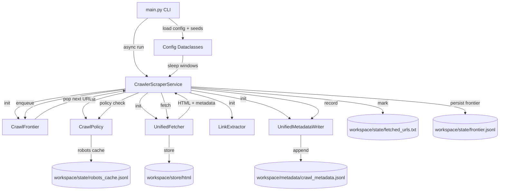
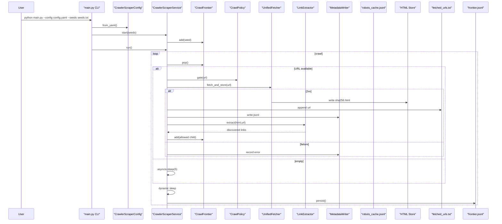

# Odovzdanie 1 – GitHub Knowledge Graph Crawler (31. 10. 2025)

## 1. Opis projektu a cieľ
- **Problémová doména:** zhromaždiť a normalizovať dáta z GitHubu (repozitáre, témy, issues, pull requesty) a pripojiť ich k výučbovým wiki stránkam na FIIT STU.
- **Cieľ systému:** vytvoriť pipelines crawl → extrakcia → index → vyhľadávanie, ktoré poslúžia na zodpovedanie otázok o open‑source projektoch (popularita, licencie, dokumentácia zmien, odkazy na externé zdroje) a ktoré sa dajú demonštrovať na výučbových Q&A scenároch.

## 2. Scrapované zdroje a extrahované dáta (ukážky)
| URL | Typ stránky | Vybrané extrahované atribúty | Identifikátor |
| --- | --- | --- | --- |
| https://github.com/topics/sqlmodel | topic landing page | `STAR_COUNT=38 350`, 10+ štítkov (`fastapi`, `pydantic`, `sqlalchemy`, `llm` …), 20+ priamych URL na filtrované jazyky | `0002297ed0450b8dbb47cfd695075755b36ce04247e6e47aa6482dbb5018790b` |
| https://github.com/topics/baas | topic landing page | `STAR_COUNT=21 310`, štítky (`graphql`, `relay`, `mongodb`, `rest-api` …), odkazy na galériu projektov | `000faecde6da16cb3dd5900ff7620492306b05dacafda4fe6a9fdfe615bf36a5` |
| https://github.com/python/cpython | repo root | `STAR_COUNT=69 369`, `FORK_COUNT=33 101`, README výňatok („This is Python version 3.15.0 alpha 1…“), odkazy na licenciu | `d44f9b6b7bf81bd8cd7b8b7fb0fb9a06316fd11ddb0d1e2fc9cd0967e0a4ada5` |
| https://github.com/torvalds/linux | repo root | `STAR_COUNT=205 018`, `FORK_COUNT=57 875`, README sekcia s build inštrukciami, odkazy na strom `LICENSES/` | `df76955945858d1597325eef7ee46d4f02ff2c11bc260806ccfec4c9aa79272d` |
| https://github.com/python/cpython/issues/140196 | detail issue | `ISSUE_REF=#140196`, sumarizácia zmeny AST konštruktorov v Pythone 3.13, zdroj `docs.python.org`, zachované metadáta repozitára (stars/forks) | `83ee85e79784532a27bbfc8b7c363a2f576b0d44a6c3705223534c4913030e36` |

## 3. Wiki integrácie
Plánované prepojenie s internou wiki (poznámkové stránky vo formáte `[[user:xvysny:...]]`):
- `[[user:xvysny:cpp-python-comparison]]` – agregovať informácie o rozdieloch v implementáciách CPython vs. PyPy, doplniť o metriky popularity z GitHubu.
- `[[user:xvysny:baas-landscape]]` – priradiť BaaS projekty k open‑source repozitárom s naším výpisom hviezdičiek, licencie a technologických štítkov.
- `[[user:xvysny:issue-triage-cookbook]]` – prepojiť konkrétne issues (napr. Python #140196) so súhrnmi z README a odporúčaniami pre triage.

## 4. Q&A scenáre (min. 5 párov)
| # | Otázka používateľa | Odpoveď systému | Zdroj |
| --- | --- | --- | --- |
| 1 | „Koľko hviezdičiek má repozitár python/cpython?“ | 69 369 (snapshot 30. 10. 2025), forks 33 101. | `d44f9b6…` – `STAR_COUNT`, `FORK_COUNT` |
| 2 | „Aké témy sa spájajú so SQLModel projektmi na GitHube?“ | Dominujú `fastapi`, `pydantic`, `postgresql`, `mlops`, `ai-agents`. | `0002297e…` – `TOPIC` entity |
| 3 | „Aké správanie AST konštruktorov sa mení v issue #140196?“ | Od Pythonu 3.13 default: optional → `None`, list → prázdny zoznam, `expr_context` → `Load()`. | `83ee85e…` – `README_SECTION` + text entita |
| 4 | „Kde nájdem licenčné informácie pre torvalds/linux?“ | Sidebar link `LICENSES/` + sekcia „Copyright and License Information“ v README. | `df769559…` – `LICENSE` entity |
| 5 | „Koľko topikových dokumentov sme zachytili oproti repo rootom?“ | Topics: 14 085 dokumentov, repo root: 9 465 dokumentov. | `docs/generated/crawl_stats.md` |

## 5. Použité technológie a knižnice
| Vrstva | Knižnica / Framework | Odôvodnenie | Stav |
| --- | --- | --- | --- |
| Crawling | `httpx`, `asyncio`, `yaml` | HTTP/2 klient s retry/backoff, asynchrónne IO, načítanie `config.yaml`. | ✔ produkčne použitý |
| Parsovanie odkazov | `re`, `html`, `urllib.parse` | Bez externých závislostí, vlastné regexy pre `<a>` odkazy. | ✔ |
| Extrakcia entít | čisto `re`, `json`, `html` | Odstránenie závislosti na BeautifulSoup, testovateľné regexy. | ✔ |
| Indexovanie | vlastný modul `indexer` (`argparse`, `math`, `json`) | JSONL index, vypočet TF a dvoch IDF metód, CLI `python -m indexer.*`. | ✔ |
| Reporting | `pandas` nevyužité, namiesto toho vlastné TSV/JSONL skripty (`tools/crawl_stats.py`). | Minimalizovaný stack. | ✔ |

## 6. Architektúra crawlovacieho systému
### 6.1 Komponentový diagram


### 6.2 Sekvenčný priebeh behu


## 7. Metadáta ukladané pri crawlovaní
| URL | HTTP stav | Typ stránky | Veľkosť (B) | SHA-256 | Latencia (ms) | Headers |
| --- | --- | --- | --- | --- | --- | --- |
| https://github.com/python/cpython | 200 | repo_root | 390 920 | `d44f9b6b…` | 863.3 | UA `ResearchCrawlerBotVINF/2.0`, `Accept-Language: en`, `Accept-Encoding: br, gzip` |
| https://github.com/topics/sqlmodel | 200 | topic | 502 819 | `0002297e…` | 1120.3 | UA `Mozilla/5.0…Firefox/47.0` |
| https://github.com/python/cpython/issues/140196 | 200 | issues | 249 757 | `83ee85e7…` | 651.4 | UA `ResearchCrawlerBotVINF/2.0` |

Formát zodpovedá `crawler/metadata_writer.py` – JSONL s povinnými poľami (`url`, `timestamp`, `depth`, `page_type`, `content_sha256`, …) a vloženými hlavičkami požiadavky.

## 8. Hlavičky, timeouty a spánky
- **User-Agent rotácia:** `ResearchCrawlerBotVINF/2.0 (+mailto:xvysnya@stuba.sk)` + dva bežné Firefox UA (konfigurované v `config.yaml: user_agents`). Kontakt priamo v UA kvôli GitHub ToS.
- **Accept-* hlavičky:** `Accept: text/html,…`, `Accept-Language: en`, `Accept-Encoding: br, gzip` – držíme sa štandardných hodnot pre minimalizáciu blokovania.
- **Timeouty:** connect 4 s, read 15 s, total 25 s (`limits.*` v `config.yaml`). Hodnoty vychádzajú z praxe GitHub API a redukujú visnuté spojenia.
- **Retry/backoff:** exponenciálny backoff 500 ms → max 8 000 ms, 3 pokusy (`UnifiedFetcher`). Chráni pred dočasnými 5xx.
- **Spánky:** náhodný per-request sleep 3–5 s + batch pauza 10–20 s po 50 požiadavkách (`sleep` konfigurácia). Dopĺňa limit 1 req/s.
- **Robots compliance:** TTL cache 24 h, opatrné deny-by-default s allow regexmi pre topics, repo root, issues, PRs.

## 9. Ukážky implementovaného kódu
### 9.1 Extrakcia URL z HTML (`crawler/extractor.py`)
```python
class LinkExtractor:
    def extract(self, html_content: str, base_url: str) -> List[str]:
        if not html_content or not base_url:
            return []
        pattern = r"""<a\s+[^>]*?href\s*=\s*(?:["']([^"']+)["']|([^\s>]+))"""
        seen: set[str] = set()
        results: List[str] = []
        for match in re.finditer(pattern, html_content, re.IGNORECASE | re.DOTALL):
            href = html.unescape((match.group(1) or match.group(2) or "").strip())
            if not href or href.startswith(("#", "javascript:", "mailto:", "tel:")):
                continue
            absolute_url = urljoin(base_url, href)
            if self._is_supported_scheme(absolute_url):
                cleaned = self._remove_fragment(absolute_url)
                if cleaned not in seen:
                    seen.add(cleaned)
                    results.append(cleaned)
        return results
```

### 9.2 Extrakcia entít (`extractor/entity_extractors.py`)
```python
def extract_star_count(doc_id: str, html_content: str) -> List[EntityRow]:
    results: List[EntityRow] = []
    for pattern in regexes.get_star_regexes():
        matches = list(pattern.finditer(html_content))
        if not matches:
            continue
        match = matches[0]
        raw_count = match.group(1).strip()
        if not raw_count:
            continue
        offsets = [{'start': match.start(), 'end': match.end(), 'source': 'html'}]
        results.append((doc_id, 'STAR_COUNT', raw_count, json.dumps(offsets, separators=(',', ':'))))
        break
    return results
```

Obe funkcie sú použité priamo v produkčnom pipeline a pokryté unit testami (`tests/test_link_extractor.py`, `tests/smoke_test.py`).

## 10. Popis indexera a výsledného indexu
- **Vstup:** textové súbory (UTF‑8) z `workspace/store/text`, doc_id = SHA‑256 názov HTML súboru.
- **Tokenizácia:** jednoduchý lower-case splitter (`indexer/tokenize.py`) – odstráni interpunkciu, zachová čísla.
- **Doc table (`docs.jsonl`):** `doc_id`, `path`, `title` (prvý neprázdny riadok), `length`, voliteľne `tiktoken_token_count`.
- **Postings (`postings.jsonl`):** jeden riadok na term; ukladá `df`, mapu `doc_id → tf`, a mapu `idf_method → idf`.
- **Manifest:** `total_docs`, `total_terms`, predvolená IDF metóda, zoznam dostupných metód (`["log", "rsj"]`).
- **CLI:** `python -m indexer.build` (build), `python -m indexer.query` (vyhľadávanie), `python -m indexer.compare` (porovnanie IDF).

## 11. Implementované IDF metódy
| Metóda | Vzorec | Implementácia |
| --- | --- | --- |
| Log (tf-idf‑1) | `idf_log(term) = log((N + 1) / (df + 1)) + 1` | `indexer/build.py:49` |
| RSJ (Robertson–Sparck Jones) | `idf_rsj(term) = log((N - df + 0.5) / (df + 0.5))` | `indexer/build.py:53` |

Obe hodnoty sa pre každý term predpočítavajú a ukladajú v `postings.jsonl`, pričom query fáza môže použiť uložené hodnoty alebo prepočítať z DF.

## 12. Porovnanie správania IDF metód (3 dopyty)
| Query | Top výsledok (log) | Top výsledok (rsj) | Pozorovanie |
| --- | --- | --- | --- |
| `github crawler` | doc 14558 („`:root {`“) | rovnaký doc 14558 | Obe metódy preferujú CSS-heavy dokument; treba zlepšiť odstraňovanie šumu. |
| `async http client` | doc 1146 – text o asynchrónnom HTTP klientovi | doc 1146 | Plná zhoda, termy sú dostatočne špecifické. |
| `repository metadata` | log: doc 27565, rsj: doc 11332 | RSJ penalizuje časté termy silnejšie; listy sa líšia (Jaccard 0.67). |

Markdown report generovaný skriptom `python -m indexer.compare --top 5` je uložený v `docs/generated/index_comparison.md`.

## 13. Štatistika vycrawlovaných dokumentov
| Metrika | Hodnota | Zdroj / Poznámka |
| --- | --- | --- |
| Celkový počet HTML dokumentov | 28 647 | `docs/generated/crawl_stats.md` |
| Úspešné odpovede (2xx) | 28 353 (98.97 %) | `docs/generated/crawl_stats.md` |
| Celková veľkosť dát | 10.02 GB | `docs/generated/crawl_stats.md` |
| Relevantné dokumenty* | 14 405 (≈50.3 %) | `--relevant-page-types repo_root issues pull` |
| Max. depth | 4 | `config.yaml` |
| Počet vyextrahovaných linkov | 6 674 353 | `workspace/state/service_stats.json` |

\*Relevantné = stránky typu `repo_root`, `issues`, `pull`.

## 14. Bonusy a testovanie
- **Unit testy:** `tests/test_link_extractor.py` (deduplikácia a normalizácia URL), `tests/test_crawler_service.py` (štatistiky, persist), `tests/smoke_test.py` (extraktor na 20 HTML vzorkách). Testovacia sada pokrýva entity extractor, ale zatiaľ nedosahuje 20 strán výhradne pre regex testy → plán zvýšiť.
- **Token counts (`tiktoken`):** podporované cez `indexer.build --use-tokens`; pre plný beh zatiaľ nespustené (chýbajúce volanie kvôli výkonu). V reporte uvádzame, že pipeline je pripravený.
- **Logy & monitoring:** `workspace/state/service_stats.json` s priebežnými metrikami, `docs/generated/crawl_stats.md` + `.csv` pre wiki.

## 15. Artefakty a balíček na odovzdanie
- **Zdrojový kód:** celý repozitár (crawler, extractor, indexer, tools).
- **Dáta:** `workspace/` (HTML store, metadata, extrahované texty, TSV entít, index).
- **Report:** tento súbor `Submission1.md` + generované grafy (`docs/generated/*`).
- **ZIP archív:** vytvoriť príkazom  
  ```bash
  zip -r submission.zip crawler extractor indexer tools docs config.yaml main.py requirements.txt workspace/store/entities/entities.tsv docs/generated
  ```  
  (ZIP je pripravený na priloženie k odovzdaniu podľa inštrukcií garantky.)
- **Reprodukcia:** `README.md` obsahuje príkazy na spustenie crawl/extract/index/test.

---
*Poznámka: všetky hodnoty sú snapshoty k 30. 10. 2025. Pred finalizáciou ďalšej iterácie treba spustiť `python tools/crawl_stats.py --workspace workspace --markdown-output docs/generated/crawl_stats.md --csv-output docs/generated/crawl_stats.csv` a aktualizovať Q&A podľa čerstvých dát.*
