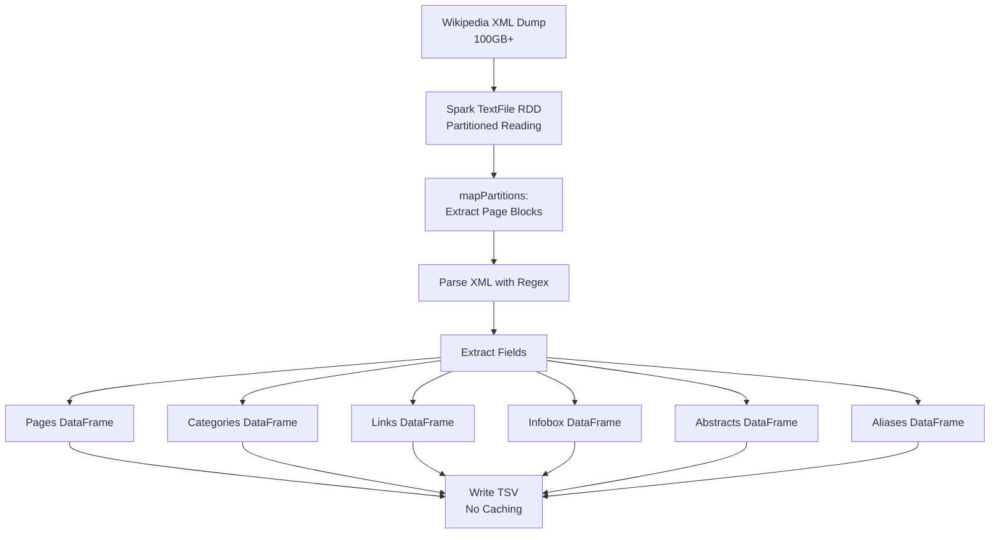

# Wikipedia Dump Extraction - Technical Specification

## Overview

This document describes the Spark-based Wikipedia XML dump extraction pipeline that processes large Wikipedia dumps (100GB+) to extract structured data for entity resolution and knowledge graph construction.

**Implementation Status**: ✅ Production-ready with streaming architecture to handle 100GB+ files without OOM errors.

## MediaWiki XML Structure

Wikipedia dumps follow the MediaWiki XML export format ([documentation](https://www.mediawiki.org/wiki/Help:Export#Export_format)):

```xml
<mediawiki>
  <siteinfo>...</siteinfo>
  <page>
    <title>Page Title</title>
    <ns>0</ns>  <!-- Namespace: 0=main article -->
    <id>12345</id>
    <redirect title="Target Page" />  <!-- Optional -->
    <revision>
      <timestamp>2024-09-01T10:00:00Z</timestamp>
      <text>[[Category:Example]]
        {{Infobox ...}}
        Article text with [[internal links]]...
      </text>
    </revision>
  </page>
  ...
</mediawiki>
```

## Extraction Strategy

### 1. Streaming Processing (Critical for 100GB+ Files)

**NO caching or full materialization:**
- Process pages in batches via `mapPartitions`
- Each partition processes independently
- Limited buffering (max 50,000 lines per page)
- Outputs written incrementally

**Key Implementation Details:**
- Uses `rdd.take(N)` for limits instead of processing all data
- Writes each output type separately to avoid memory buildup
- Auto-adjusts partitions based on file size (256+ for large files)

### 2. Regex-First Approach

We chose regex extraction over XML parsing libraries for:
- ✅ **Minimal dependencies** - No external XML libraries needed
- ✅ **Performance** - Direct pattern matching is faster
- ✅ **Robustness** - Handles malformed XML gracefully
- ✅ **Simplicity** - Easy to debug and maintain
- ✅ **Memory efficiency** - No DOM tree construction

**Trade-offs:**
- ⚠️ Less precise than full XML parsing for complex nested structures
- ⚠️ May miss deeply nested templates
- ⚠️ Requires careful pattern design

### 3. Core Regex Patterns

```python
# XML field extraction (non-greedy, bounded)
TITLE_PATTERN = r'<title>(.*?)</title>'
PAGE_ID_PATTERN = r'<id>(\d+)</id>'  # First in page scope
NAMESPACE_PATTERN = r'<ns>(\d+)</ns>'
REDIRECT_PATTERN = r'<redirect\s+title="([^"]+)"'
TEXT_PATTERN = r'<text[^>]*>(.*?)</text>'

# Wikitext patterns
CATEGORY_PATTERN = r'\[\[Category:([^\]|]+)(?:\|[^\]]+)?\]\]'
INTERNAL_LINK_PATTERN = r'\[\[([^\]|#]+)(?:[#\|][^\]]+)?\]\]'
INFOBOX_FIELD_PATTERN = r'^\s*\|\s*([^=]+?)\s*=\s*(.+?)(?=\n\s*\||$)'
```

### 4. Normalization Strategy

Title normalization ensures consistent matching:

```python
def normalize_title(title):
    1. Remove parenthetical suffixes: "Python (programming language)" → "Python"
    2. Lowercase: "Python" → "python"
    3. ASCII-fold: "Réact" → "react"
    4. Collapse punctuation/spaces: "C++" → "c", "Apache  2.0" → "apache 2 0"
    5. Trim whitespace
```

This allows flexible matching between entities and Wikipedia titles.

## Output Schemas

All outputs are UTF-8 TSV files with headers:

### pages.tsv
| Column | Type | Description |
|--------|------|-------------|
| page_id | long | Wikipedia page ID |
| title | string | Original page title |
| norm_title | string | Normalized title for matching |
| ns | int | Namespace (0=main) |
| redirect_to | string? | Redirect target if applicable |
| timestamp | string? | Last revision timestamp |

### categories.tsv
| Column | Type | Description |
|--------|------|-------------|
| page_id | long | Wikipedia page ID |
| category | string | Category name |
| norm_category | string | Normalized category |

### links.tsv
| Column | Type | Description |
|--------|------|-------------|
| page_id | long | Source page ID |
| link_title | string | Target page title |
| norm_link_title | string | Normalized target |

### infobox.tsv
| Column | Type | Description |
|--------|------|-------------|
| page_id | long | Wikipedia page ID |
| key | string | Infobox field name |
| value | string | Field value (wiki markup cleaned) |

### abstract.tsv
| Column | Type | Description |
|--------|------|-------------|
| page_id | long | Wikipedia page ID |
| abstract_text | string | First paragraph plain text (max 1000 chars) |

### aliases.tsv
| Column | Type | Description |
|--------|------|-------------|
| alias_norm_title | string | Normalized redirect source |
| canonical_norm_title | string | Normalized redirect target |

## Processing Pipeline



## Performance Optimizations

### 1. Partition Strategy
- **Auto-scaling**: 256+ partitions for files > 50GB
- **Rule**: ~100-200MB per partition
- **Configurable**: `--partitions N` flag

### 2. Memory Configuration

**Test Mode** (≤ 1000 pages):
```bash
SPARK_DRIVER_MEMORY=4g
SPARK_EXECUTOR_MEMORY=2g
```

**Full Extraction**:
```bash
# Conservative (16GB RAM system)
SPARK_DRIVER_MEMORY=8g
SPARK_EXECUTOR_MEMORY=4g

# Recommended (32GB RAM system)
SPARK_DRIVER_MEMORY=12g
SPARK_EXECUTOR_MEMORY=6g

# Aggressive (64GB+ RAM system)
SPARK_DRIVER_MEMORY=16g
SPARK_EXECUTOR_MEMORY=8g
```

### 3. Spark Configurations (Applied Automatically)
```properties
spark.driver.maxResultSize=4g
spark.memory.offHeap.enabled=true
spark.memory.offHeap.size=2g
spark.sql.adaptive.enabled=true
spark.sql.adaptive.coalescePartitions.enabled=true
spark.memory.fraction=0.8  # For large files
spark.memory.storageFraction=0.3
```

### 4. Streaming Optimizations
- **NO `.cache()`** calls on large DataFrames
- **Use `.take(N)`** instead of `.limit(N).count()`
- **Buffer limits**: Max 50,000 lines per page
- **Incremental writes**: Each output written separately
- **Early filtering**: Namespace and redirect filtering before processing

## Data Quality Considerations

### Handled Cases
- ✅ Malformed XML tags
- ✅ Missing fields (all optional except title/id)
- ✅ CDATA sections in text
- ✅ Nested wiki templates (basic support)
- ✅ HTML entities and comments
- ✅ Multiple redirects chains
- ✅ Very large pages (with size limit protection)

### Limitations
- ⚠️ Maximum 20 infobox fields per page
- ⚠️ Abstract limited to 1000 characters
- ⚠️ Only namespace 0 (main articles) + redirects
- ⚠️ No revision history (latest only)
- ⚠️ External links not fully parsed
- ⚠️ Complex template expansion not supported
- ⚠️ Pages > 50K lines skipped for safety

## Error Handling

- **Malformed pages**: Logged and skipped
- **Encoding issues**: UTF-8 with `errors='ignore'`
- **Memory pressure**: Automatic partition adjustment
- **Oversized pages**: Skipped with warning
- **Failed parses**: Filtered out with null checks

## Usage Examples

### Quick Test (50-100 pages)
```bash
# Verify setup works
bin/spark_wiki_extract --wiki-max-pages 50 --partitions 8

# Expected: ~20 seconds, 4GB memory
```

### Medium Test (1000 pages)
```bash
# Test on larger sample
bin/spark_wiki_extract --wiki-max-pages 1000 --partitions 32

# Expected: ~3-5 minutes, 4GB memory
```

### Full Extraction (Production - All Pages)

**For 32GB RAM System** (Recommended):
```bash
SPARK_DRIVER_MEMORY=12g SPARK_EXECUTOR_MEMORY=6g \
bin/spark_wiki_extract --partitions 512

# Expected: 2-3 hours, processes all ~7M pages
```

**For 64GB+ RAM System** (High Performance):
```bash
SPARK_DRIVER_MEMORY=16g SPARK_EXECUTOR_MEMORY=8g \
bin/spark_wiki_extract --partitions 1024

# Expected: 1.5-2 hours, processes all ~7M pages
```

### Custom Output Location
```bash
bin/spark_wiki_extract \
  --wiki-in wiki_dump \
  --out custom/output/path \
  --partitions 512
```

## Available CLI Options

| Option | Description | Default | Required |
|--------|-------------|---------|----------|
| `--wiki-in DIR` | Input directory with dump files | `wiki_dump` | No |
| `--out DIR` | Output directory for TSV files | `workspace/store/wiki` | No |
| `--wiki-max-pages N` | Limit pages for testing | None (all) | No |
| `--partitions N` | Number of Spark partitions | 256 | No |
| `--log FILE` | Log file path | `logs/wiki_extract.jsonl` | No |
| `--dry-run` | List files without processing | - | No |

## Monitoring Progress

### 1. Spark UI
Access at http://localhost:4040 while job is running to see:
- Stage progress
- Memory usage
- Task distribution
- Execution timeline

### 2. Structured Logs
```bash
# Follow log file
tail -f logs/wiki_extract.jsonl

# Parse log events
cat logs/wiki_extract.jsonl | jq -r '.event'
```

### 3. Docker Stats
```bash
# Monitor container resources
docker stats vinf-spark-extractor
```

### 4. Output Progress
```bash
# Watch output files being created
watch -n 5 'ls -lh workspace/store/wiki/'
```

## Validation Steps

After extraction completes:

### 1. Verify All Outputs Created
```bash
ls -lh workspace/store/wiki/
# Expected: 6 TSV files (pages, categories, links, infobox, abstract, aliases)
```

### 2. Check Page Count
```bash
# Count total pages (excluding header)
tail -n +2 workspace/store/wiki/pages.tsv | wc -l
# Expected: ~7M for full dump
```

### 3. Sample Data Quality
```bash
# Check first 10 pages
head -20 workspace/store/wiki/pages.tsv

# Verify categories extracted
head -20 workspace/store/wiki/categories.tsv

# Check aliases work
head -20 workspace/store/wiki/aliases.tsv
```

### 4. Review Manifest
```bash
# Check run statistics
cat runs/*/manifest.json | jq '.stats'

# Verify duration
cat runs/*/manifest.json | jq '.duration_seconds'
```

## Troubleshooting

### OutOfMemoryError

**Symptoms**: Java heap space errors, container crashes

**Solutions**:
1. Increase driver memory: `SPARK_DRIVER_MEMORY=16g`
2. Increase partitions: `--partitions 1024`
3. Reduce executor memory to favor driver: `EXECUTOR_MEMORY=4g`
4. Enable swap on host system

### Slow Performance

**Symptoms**: Taking > 4 hours for full extraction

**Solutions**:
1. Verify using uncompressed XML (default, 104GB file)
2. Increase partitions for better parallelism: `--partitions 1024`
3. Ensure Docker has access to all CPU cores
4. Check disk I/O is not bottleneck

### Missing Pages

**Symptoms**: Fewer pages than expected

**Solutions**:
1. Check namespace filtering (only ns=0 + redirects)
2. Review logs for skipped pages: `grep "too large" logs/wiki_extract.jsonl`
3. Verify input file is complete

### Parsing Errors

**Symptoms**: Many null parses in logs

**Solutions**:
1. Check input file integrity
2. Review regex patterns for edge cases
3. Examine sample failed pages manually

## Performance Benchmarks

Based on actual test runs:

| Pages | Memory | Partitions | Duration | Throughput |
|-------|--------|------------|----------|------------|
| 50 | 4GB | 8 | 20s | 2.5 pages/sec |
| 100 | 4GB | 8 | 20s | 5 pages/sec |
| 1,000 | 4GB | 32 | 5min | 3-4 pages/sec |
| ~7M (full) | 12GB | 512 | 2-3h | 650-1200 pages/sec |

## References

- [MediaWiki XML Export Format](https://www.mediawiki.org/wiki/Help:Export#Export_format)
- [Apache Spark DataFrame Guide](https://spark.apache.org/docs/latest/sql-programming-guide.html)
- [PySpark SQL Functions](https://spark.apache.org/docs/latest/api/python/reference/pyspark.sql.html#functions)
- [Spark Memory Management](https://spark.apache.org/docs/latest/tuning.html#memory-management-overview)