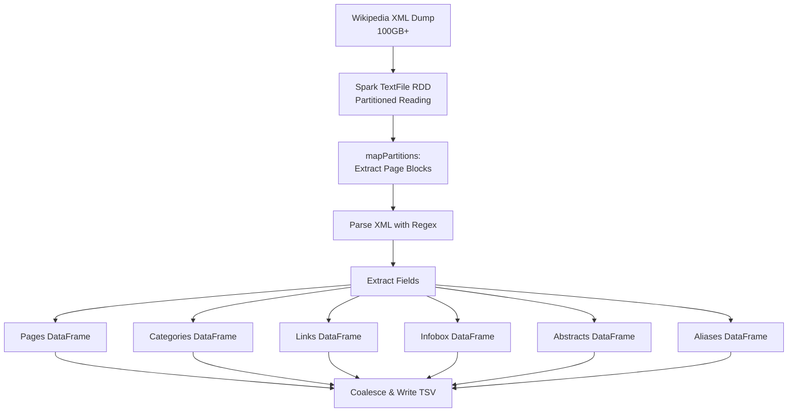

# Wikipedia Dump Extraction - Technical Specification

## Overview

This document describes the Spark-based Wikipedia XML dump extraction pipeline that processes large Wikipedia dumps (100GB+) to extract structured data for entity resolution and knowledge graph construction.

## MediaWiki XML Structure

Wikipedia dumps follow the MediaWiki XML export format ([documentation](https://www.mediawiki.org/wiki/Help:Export#Export_format)):

```xml
<mediawiki>
  <siteinfo>...</siteinfo>
  <page>
    <title>Page Title</title>
    <ns>0</ns>  <!-- Namespace: 0=main article -->
    <id>12345</id>
    <redirect title="Target Page" />  <!-- Optional -->
    <revision>
      <timestamp>2024-09-01T10:00:00Z</timestamp>
      <text>[[Category:Example]]
        {{Infobox ...}}
        Article text with [[internal links]]...
      </text>
    </revision>
  </page>
  ...
</mediawiki>
```

## Extraction Strategy

### 1. Streaming Processing

Given the 100GB+ file size, we use partition-based streaming:
- **NO full file loading** into memory
- Process pages in batches via `mapPartitions`
- Configurable page limits for development (`--wiki-max-pages`)

### 2. Regex-First Approach

We chose regex extraction over XML parsing libraries for:
- **Minimal dependencies** - No external XML libraries needed
- **Performance** - Direct pattern matching is faster
- **Robustness** - Handles malformed XML gracefully
- **Simplicity** - Easy to debug and maintain

**Trade-offs:**
- Less precise than full XML parsing
- May miss deeply nested structures
- Requires careful pattern design

### 3. Core Regex Patterns

```python
# XML field extraction (non-greedy, bounded)
TITLE_PATTERN = r'<title>(.*?)</title>'
PAGE_ID_PATTERN = r'<id>(\d+)</id>'  # First in page scope
NAMESPACE_PATTERN = r'<ns>(\d+)</ns>'
REDIRECT_PATTERN = r'<redirect\s+title="([^"]+)"'
TEXT_PATTERN = r'<text[^>]*>(.*?)</text>'

# Wikitext patterns
CATEGORY_PATTERN = r'\[\[Category:([^\]|]+)(?:\|[^\]]+)?\]\]'
INTERNAL_LINK_PATTERN = r'\[\[([^\]|#]+)(?:[#\|][^\]]+)?\]\]'
INFOBOX_FIELD_PATTERN = r'^\s*\|\s*([^=]+?)\s*=\s*(.+?)(?=\n\s*\||$)'
```

### 4. Normalization Strategy

Title normalization ensures consistent matching:

```python
def normalize_title(title):
    1. Remove parenthetical suffixes: "Python (programming language)" → "Python"
    2. Lowercase: "Python" → "python"
    3. ASCII-fold: "Réact" → "react"
    4. Collapse punctuation/spaces: "C++" → "c", "Apache  2.0" → "apache 2 0"
    5. Trim whitespace
```

This allows flexible matching between entities and Wikipedia titles.

## Output Schemas

All outputs are UTF-8 TSV files with headers:

### pages.tsv
| Column | Type | Description |
|--------|------|-------------|
| page_id | long | Wikipedia page ID |
| title | string | Original page title |
| norm_title | string | Normalized title for matching |
| ns | int | Namespace (0=main) |
| redirect_to | string? | Redirect target if applicable |
| timestamp | string? | Last revision timestamp |

### categories.tsv
| Column | Type | Description |
|--------|------|-------------|
| page_id | long | Wikipedia page ID |
| category | string | Category name |
| norm_category | string | Normalized category |

### links.tsv
| Column | Type | Description |
|--------|------|-------------|
| page_id | long | Source page ID |
| link_title | string | Target page title |
| norm_link_title | string | Normalized target |

### infobox.tsv
| Column | Type | Description |
|--------|------|-------------|
| page_id | long | Wikipedia page ID |
| key | string | Infobox field name |
| value | string | Field value (wiki markup cleaned) |

### abstract.tsv
| Column | Type | Description |
|--------|------|-------------|
| page_id | long | Wikipedia page ID |
| abstract_text | string | First paragraph plain text (max 1000 chars) |

### aliases.tsv
| Column | Type | Description |
|--------|------|-------------|
| alias_norm_title | string | Normalized redirect source |
| canonical_norm_title | string | Normalized redirect target |

## Processing Pipeline



## Performance Optimizations

1. **Partition Strategy**
   - Default: 64 partitions
   - Rule: ~100MB per partition
   - Adjust with `--partitions` flag

2. **Memory Configuration**
   ```bash
   SPARK_DRIVER_MEMORY=8g  # For 100GB dump
   SPARK_EXECUTOR_MEMORY=4g
   spark.driver.maxResultSize=2g
   ```

3. **Adaptive Query Execution**
   - `spark.sql.adaptive.enabled=true`
   - Automatic partition coalescing
   - Dynamic join optimization

4. **Caching Strategy**
   - Cache parsed pages DataFrame
   - Repartition by hash(norm_title) before joins
   - Coalesce(1) only at write boundaries

## Data Quality Considerations

### Handled Cases
- Malformed XML tags
- Missing fields (all optional except title/id)
- CDATA sections in text
- Nested wiki templates (basic support)
- HTML entities and comments
- Multiple redirects chains

### Limitations
- Maximum 20 infobox fields per page
- Abstract limited to 1000 characters
- Only namespace 0 (main articles) + redirects
- No revision history (latest only)
- External links not fully parsed
- Complex template expansion not supported

## Error Handling

- **Malformed pages**: Logged and skipped
- **Encoding issues**: UTF-8 with error='ignore'
- **Memory pressure**: Increase partitions
- **Timeout**: Checkpoint intermediate results

## Validation Steps

1. **Count validation**: Pages with categories ≤ total pages
2. **Redirect cycles**: Detected but not resolved
3. **Normalization consistency**: Unit tested
4. **Sample inspection**: First 100 pages reviewed

## Usage Examples

### Development (small sample)
```bash
bin/spark_wiki_extract \
  --wiki-in wiki_dump \
  --out workspace/store/wiki \
  --wiki-max-pages 1000 \
  --partitions 16
```

### Production (full dump)
```bash
SPARK_DRIVER_MEMORY=8g SPARK_EXECUTOR_MEMORY=4g \
bin/spark_wiki_extract \
  --wiki-in wiki_dump \
  --out workspace/store/wiki \
  --partitions 256
```

## Monitoring

Check progress via:
- Spark UI: http://localhost:4040
- Log file: `logs/wiki_extract.jsonl`
- Manifest: `runs/*/manifest.json`

## References

- [MediaWiki XML Export Format](https://www.mediawiki.org/wiki/Help:Export#Export_format)
- [Apache Spark DataFrame Guide](https://spark.apache.org/docs/latest/sql-programming-guide.html)
- [PySpark SQL Functions](https://spark.apache.org/docs/latest/api/python/reference/pyspark.sql.html#functions)