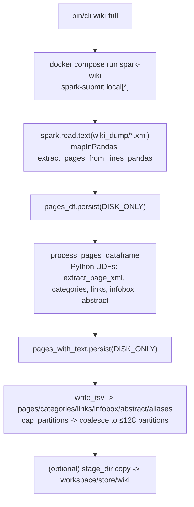

# Wikipedia Extractor Diagnostics
- Examined `bin/cli`, `docker-compose.yml` (`spark-wiki` service), `spark/jobs/wiki_extractor.py`, helpers in `spark/lib/`, `config.yml`, repo guides (`AGENTS.md`, `CLAUDE.md`, `GEMINI.md`, `README.md`, `FULL_RUN_GUIDE.md`).
- Parsed run logs: `working_multi.log` (10k/100k/1M samples), `error_full_.log` (failed full run), `logs/wiki_extract.jsonl` (repeated full-run errors and one partial 2.3M-page completion).
- Goal: explain why `bin/cli wiki-full` (no sample) stalls while sampled runs finish.

## Pipeline Reconstruction (wiki-full path)

Data flow: Wikipedia XML → line DataFrame → `mapInPandas` batches → UDF parsing → DISK_ONLY cache → multiple TSV writes (text extraction disabled by wiki-full defaults).

## Behaviour: Samples vs Full Run
Successful sample runs (`working_multi.log`, wiki-full with `--sample`, text disabled):

| Sample arg | Pages written | Runtime | Throughput | Partition notes |
| --- | --- | --- | --- | --- |
| 10,000 | 7,643 | 21.7s | ~351 pages/s | Reader 831 → coalesced to 16; AQE shrank output to **1 partition** |
| 100,000 | 77,705 | 105s | ~738 pages/s | Reader 831, output **1 partition** |
| 1,000,000 | 777,755 | 420s | ~1,851 pages/s | Reader 831, output **1 partition** |

Failing full run (`error_full_.log`, `bin/cli wiki --no-text --force`):
- Input: `enwiki-20250901-pages-articles-multistream.xml` (111.5GB).
- Reader partitions: 831 → **coalesced to 128** before writing `pages.tsv`.
- Stage 0 (write pages) crawled: 0→32/128 tasks over ~22 minutes, then Python worker crashed (`PythonUDFRunner` connection reset/EOF) while writing pages; job aborted. CPU/IO drop after initial burst matches long-lived, oversized tasks and worker death.

`logs/wiki_extract.jsonl` shows multiple full runs failing with `"An error occurred while calling oXXX.csv"` during writes; one partial run completed ~2.34M pages (with `max_pages=3_000_000`), implying instability when tasks grow large.

## Spark Implementation Review (spark/jobs/wiki_extractor.py)
- **Input reading**: `spark.read.text` + `mapInPandas` (`extract_pages_from_lines_pandas`) loads each partition into pandas, assembles `<page>` blocks. Large partitions push whole batches into Python memory.
- **Partitioning & AQE**: Spark config hardcodes `spark.sql.adaptive.coalescePartitions.enabled=true` (in both docker-compose and Spark builder). Output writes also force `cap_partitions` (coalesce to ≤128). Result: even million-page samples write through a **single partition**; full run collapses 831 → 128, inflating per-task load.
- **Caching**: `pages_df` and `pages_with_text` persisted `DISK_ONLY`, but `pages_with_text` retains the full `text` column even when `--no-text` is set, so the entire dump text is spilled to `/tmp/spark` once per run.
- **Python worker memory**: wiki-full sets `SPARK_PYTHON_WORKER_MEMORY=2g`, but the generic `bin/cli wiki` path (used in the failing run) leaves the default ~1g; Python UDFs run against large, coalesced partitions → worker crashes (`EOFError`/`Connection reset`).
- **Output writing**: `write_tsv` honors `maxRecordsPerFile` but uses the coalesced partition count; no skew mitigation or checkpoint between parse and write. Writes go directly to the host bind mount (`workspace/store/wiki`), which is slow on macOS/WSL; `stage_dir` exists but wiki-full does not enable it.
- **Parallelism**: `--master local[*]` means a single JVM executor; ResourceProfile shows 1 executor with 1 core per task, so only as many tasks as cores run concurrently. With partitions collapsed, stragglers dominate.

## Root-Cause Hypotheses (ranked)
1) **Partition collapse → oversized Python tasks → worker OOM/crash**  
Evidence: full run coalesces 831 → 128 before write; tasks crawl then fail in `PythonUDFRunner` (`Connection reset`). Samples finish only because AQE shrinks to 1 partition on a much smaller dataset. Spark docs warn coalescing lowers partition count and inflates task size (Apache Spark RDD/Spark SQL coalesce guidance).

2) **DISK_ONLY caching of full `text` column even when text output is disabled**  
Evidence: `pages_with_text` persisted with the raw text; for 100GB+ input this spills the whole dump to `/tmp/spark`, increasing local disk pressure and serialization volume for every downstream DataFrame. Stalls would appear after initial I/O spike when spill saturates disk.

3) **Python worker memory too low for full run**  
Evidence: wiki-full CLI intends 2g, but docker-compose defaults to 1g and `bin/cli wiki` does not set it. Crash stack is from Python UDFs during write, consistent with worker OOM under large partitions.

4) **Slow bind-mount writes without staging**  
Evidence: Writes go straight to `workspace/store/wiki` bind mount; `stage_dir` helper exists to avoid macOS/WSL latency but is unused in wiki-full. Could explain CPU drop after some output appears.

## Recommendations (conceptual, no code changes made)
- **Keep high partition counts for full dumps**: Disable `spark.sql.adaptive.coalescePartitions.enabled` and skip `cap_partitions` when `wiki_max_pages` is None. Aim to keep ~800–1000 partitions (or higher) so per-task page counts stay small; only coalesce for small samples. Apply in `spark/jobs/wiki_extractor.py` and docker `spark-submit` conf.
- **Drop heavy columns before caching when text is off**: When `--no-text`, persist a projection without the `text` field, or cache parsed metadata separately, to avoid spilling the entire article bodies.
- **Raise Python worker memory for all full runs**: Set `SPARK_PYTHON_WORKER_MEMORY` (e.g., 2g–4g) in the compose service and propagate from `bin/cli wiki-full`/`wiki`.
- **Use staging directory on host-mount-sensitive systems**: Enable `--stage-dir /tmp/wiki_stage` (already supported) by default for wiki-full to reduce bind-mount latency, then copy once at end.
- **Guard mapInPandas batch size**: Limit lines per partition or pre-repartition before `mapInPandas` to prevent pandas batches from ballooning; consider parsing via `mapPartitions` streaming without pandas to reduce peak memory.
- **Monitor AQE effects**: If AQE stays enabled, add explicit `spark.sql.adaptive.coalescePartitions.minPartitionNum` / disable coalesce for this job to prevent auto-collapse (per Spark SQL performance tuning docs).

## Validation Plan
1) **Small sample sanity**: `bin/cli wiki-full --sample 10000` (or `bin/cli wiki --wiki-max-pages 10000`) with new partition policy; expect multi-part outputs (>1 partition), runtime ≤30s, no worker crashes. Watch Spark UI for partition counts and task sizes.
2) **Medium load**: `bin/cli wiki-full --sample 1000000`; expect partitions to stay near reader count (~800+), stable CPU, no adaptive collapse, runtime ~7–10 min.
3) **Full run**: `bin/cli wiki-full` with staging + higher worker memory; monitor Spark UI stage 0 (pages write) for steady task completion (no long-lived stragglers), disk usage under `/tmp/spark`, and absence of PythonUDFRunner errors. Success = pages/categories/links/infobox/abstract/aliases all materialize and run finishes in hours, not stuck with 0% progress.

Docs referenced: Apache Spark partition/coalesce guidance (Context7 `/apache/spark`, coalesce discussion in RDD/Spark SQL docs).
