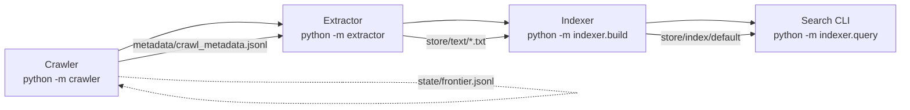

# AUDIT_REPORT

## Repository Map & Data Paths

- `config.yml` defines a single `workspace` with crawler outputs under `store/html`, extractor text dumps in `store/text`, entity TSVs under `store/entities/`, and index artefacts in `store/index/default` (`config.yml:1-86`).
- Runtime artefacts (`workspace/store/*`, `workspace/metadata`, `workspace/state`) are intentionally kept out of commits; CLI entry points exist for each stage (`crawler/__main__.py`, `extractor/__main__.py`, `indexer/build.py`, `indexer/query.py`).
- Tests mirror modules (`tests/test_regexes.py`, `tests/test_link_extractor.py`) to keep fixtures close to the logic they exercise.

## Crawler Audit

- **Robots & Policy:** `CrawlPolicy` enforces allow/deny lists, host checks, and caches robots.txt responses with TTL support (`crawler/crawl_policy.py:33-205`). Fail-closed behavior (`_check_robots_content`) denies on parse errors.
- **Frontier & Dedupe:** `CrawlFrontier` stores URLs in an append-only JSONL with hashed markers for both queue membership and fetched dedupe (`crawler/crawl_frontier.py:70-210`). Queue compaction is manual (`crawler/crawl_frontier.py:230-275`) and `fetched_urls.txt` grows unbounded.
- **Canonical URLs:** Every URL is normalized (lower-case scheme/host, fragments dropped) before enqueueing/fetching, preventing superficial duplicates (`crawler/url_tools.py:10-90`).
- **Rate limiting & retries:** The async fetcher enforces `req_per_sec` with a coroutine-level lock plus random sleeps and batch pauses in the service loop (`crawler/unified_fetcher.py:121-139`, `crawler/service.py:209-278`). HTTP 429s respect `Retry-After` and exponential backoff.
- **Content dedupe:** HTML is stored under `workspace/store/html/<sha[:2]>/<sha[2:4]>/<sha>.html`; repeated content hashes short-circuit writes but duplicate URLs still incur fetch cost (`crawler/unified_fetcher.py:286-337`).
- **Metadata:** Every fetch writes a JSON line capturing URL, depth, HTTP status, SHA, bytes, and timing info (`crawler/metadata_writer.py:25-87`). These files power later audits but are not indexed in bulk.
- **Link extraction:** Links are captured with a regex-only parser (quoted/unquoted hrefs, fragment stripping) and filtered to http/https schemes (`crawler/extractor.py:8-74`). Tests cover quoting and filtering edge cases (`tests/test_link_extractor.py:7-137`).
- **Caps:** Per-repo quotas for pages/issues/PRs guard against skew but are maintained in-memory dictionaries that reset on restart (`crawler/service.py:36-82`, `crawler/service.py:276-336`).

## Extraction & Regex Inventory

- **Pipeline:** `ExtractorPipeline` discovers `.html` under `store/html`, optionally writes raw text mirrors, and emits entities by instantiating `HtmlFileProcessor` (`extractor/pipeline.py:16-82`, `extractor/entity_main.py:17-87`).
- **HTML → Text:** GitHub-specific boilerplate is scrubbed via iterative regex removals, then tags are stripped and whitespace normalized (`extractor/html_clean.py:18-164`). Lines >5 000 chars are dropped as “minified code”.
- **Regex helpers:** `extractor/regexes.py` centralizes dozens of patterns for stars, forks, language stats, README blobs, SPDX licenses, topics, imports, URLs, and emails (`extractor/regexes.py:1-210`, `extractor/regexes.py:200-330`). Some expressions (e.g., `_README_ARTICLE_RE`, `_LANG_STATS_BLOCK_RE`) still rely on `.*?` across multi-line blocks, creating latent catastrophic-backtracking risk as HTML sizes grow.
- **Entity extraction:** Each entity extractor scans HTML, serializes offsets as JSON, and writes rows `(doc_id=html stem SHA, type, value, offsets)` (`extractor/entity_extractors.py:9-239`). Offsets always refer to raw HTML byte positions—not the cleaned text used for indexing—so downstream users must reload the HTML to highlight matches.
- **Outputs:** Entities are written through a TSV writer that enforces a header row and escapes control characters; plain text mirrors mirror the hashed directory structure (`extractor/outputs.py:12-87`).

### Regex Risk Summary

| Entity | Pattern Location | Notes |
| --- | --- | --- |
| README block | `_README_ARTICLE_RE` (`extractor/regexes.py:118-141`) | `.*?` inside DOTALL matches can still span multi-megabyte documents before quitting. |
| Language stats block | `_LANG_STATS_BLOCK_RE` (`extractor/regexes.py:84-116`) | Nested `.*?` with DOTALL may backtrack heavily on unusual markup. |
| Topic tags | `_TOPIC_TAG_RE` (`extractor/regexes.py:156-170`) | Character classes limit scope but still rely on greedy `.*?` inside attribute scanning. |
| Markdown links | `_URL_MARKDOWN_LINK_RE` (`extractor/regexes.py:214-228`) | Balanced parentheses are not enforced, risking runaway matches on malformed content. |

## Text Operations & Tokenization

- Tokenization is purely regex-based: `[A-Za-z_][A-Za-z0-9_]*|(?:0x)?[A-Fa-f0-9]+` with lowercase normalization and a length≥2 filter (`indexer/tokenize.py:15-45`). No accent folding, stemming, stopword removal, or Markdown/code-fence awareness exists.
- The extractor’s text cleaner only strips HTML; Markdown fences or code blocks preserved in README HTML trickle into the `.txt` files unaltered (`extractor/html_clean.py:82-164`).
- PDF/Markdown archives are not handled: crawler stores arbitrary MIME types, but extractor ignores non-HTML, so PDFs accumulate untouched in `store/html`.

## Indexing Pipeline

- `iter_document_records` streams sorted `.txt` files, assigns sequential `doc_id`s, and records token positions per term (`indexer/ingest.py:67-117`). Positions are kept in-memory but later discarded.
- `IndexBuilder` always runs in chunked/streaming mode: text chunks produce partial vocabularies, which are k-way merged into `postings.jsonl` plus an offset index `terms.idx` (`indexer/build.py:126-286`).
- Stored artefacts:
  - `docs.jsonl` — metadata per doc (path, title, length, optional token counts) (`indexer/store.py:26-63`).
  - `postings.jsonl` — JSON per term with `df`, `idf` table (classic/smoothed/prob/max), and `[{"doc_id", "tf"}]` postings (`indexer/store.py:65-104`).
  - `manifest.json` — doc/term counts plus IDF methods (`indexer/store.py:122-135`).
- **Positions policy:** Positions never leave memory; only `tf` is persisted. Phrase queries are therefore impossible, and snippet/highlight features must reconstruct context from source files.

## Search & Ranking

- Search loads manifest + docs + postings into `IndexRepository`, caching term lookups via `terms.idx` for lazy seeks (`indexer/search.py:120-260`).
- Ranking uses `tf_weight = 1 + log(tf)` and `idf` determined either from stored values or recomputed on the fly (`indexer/search.py:366-409`). There is no document-length normalization, so longer documents tend to dominate.
- Multiple IDF “methods” exist (classic, smoothed, probabilistic, max) (`indexer/idf.py:14-107`), but TF-IDF-1 / BM25-lite variants requested in the migration are not currently implemented.
- Manual search CLI prints matched term frequencies but lacks snippet/highlighting: user must open raw files (`indexer/query.py:180-260`).

## Bottlenecks & Operational Risks

- **CPU-bound extraction:** The entire extractor is single-threaded Python with repeated regex passes; it cannot saturate multi-core machines and becomes the slowest stage once crawling finishes (`extractor/pipeline.py:16-88`).
- **Regex blowups:** Patterns with nested `.*?` over DOTALL HTML can still exhibit catastrophic backtracking on atypical markup. Workarounds (e.g., `_LANG_STATS_BLOCK_RE`) cap attribute lengths, but there is no timeout.
- **I/O explosion:** Every HTML/text artifact lives in its own file keyed by SHA prefixes (`crawler/unified_fetcher.py:286-337`, `extractor/outputs.py:58-80`). Millions of tiny files strain inode usage and slow globbing.
- **Frontier state growth:** Frontier/fetched logs are append-only; compaction requires a manual call and is not triggered during normal runs (`crawler/crawl_frontier.py:230-275`).
- **Missing offsets in text domain:** Entity offsets point to HTML, not the cleaned text fed into the index. Highlighting/snippets therefore require re-reading raw HTML instead of leveraging the tokenized corpus.
- **Index format misalignment:** Search expects JSONL postings + manifest, whereas downstream consumers (and migration requirements) call for TSV lexicon/postings/docstore with positional data and rankers TF-IDF-1/BM25-lite.
- **No PDF/Markdown pipeline:** Non-HTML MIME types accumulate in storage without extractor coverage, skewing storage metrics and wasting crawl budget.

## Findings → Proposed Spark Steps

| Problem | Spark Migration Action |
| --- | --- |
| Single-threaded regex extraction saturates CPU and risks catastrophic backtracking on large HTML blobs. | Parallelize normalization/tokenization/regex extraction via `spark/jobs/extract_html.py`, using broadcast-safe regex specs from `spark/lib/regexes.py` with bounded attribute matches. |
| Entity offsets refer to raw HTML, making snippet/highlight computation expensive. | Recompute offsets against the text being indexed (via Spark UDF outputs) and persist them alongside postings/positions for phrase/snippet support. |
| Index artefacts lack positional data and rely on JSONL, blocking phrase queries and efficient streaming. | Emit TSV `lexicon/postings/docstore` with per-term positions (`positions_json`) and deterministic ordering to feed both TF-IDF-1 and BM25-lite rankers. |
| Search scoring lacks document-length normalization and the required TF-IDF-1 / BM25-lite formulations. | Store `norm_len` per doc in `index/docstore.tsv` so downstream rankers can compute BM25-lite (`idf2 = log((N - df + 0.5)/(df + 0.5) + 1)`, `k1=1.2`, `b=0.75`) and TF-IDF-1 without recomputing raw lengths. |
| Metadata insights are not aggregated (caps, MIME mix, crawl skew). | Spark job ingests metadata TSV/JSONL to produce `reports/spark_stats.tsv` plus `runs/<ts>/manifest.json` capturing row counts, hashes, and Spark conf for traceability. |
| Small-file explosion in `store/html` / `store/text` degrades IO throughput. | Spark job reads millions of tiny files via `wholeTextFiles` and repartitions by term/doc shards, mitigating skew with `--partitions` and writing compact TSV outputs. |
| Manual logging makes crawl/extract troubleshooting difficult. | Structured JSONL logging (`logs/spark_extract.jsonl`) from the Spark job records stage timings, counts, and skew metrics for later ingestion. |

## Outstanding Gaps

- No PDF/Markdown converter exists; Spark migration should either skip non-HTML upfront or plug in format-specific normalizers.
- Entity detection still depends on HTML-like structures; Markdown-based repositories may require supplemental regex sets.
- Phrase/snippet features will still need updates in the search layer once TSV postings (with positions) are available.
