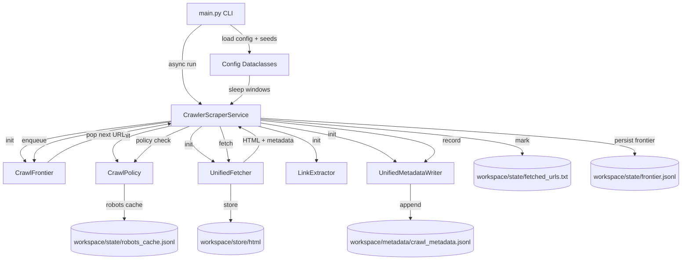
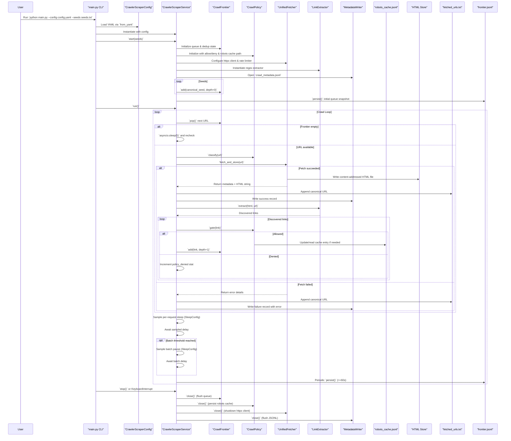

# Architecture Reference

## Overview
- Single-process async crawler tailored to GitHub; entry point `main.py` wires configuration, logging, and seeds, then drives `CrawlerScraperService`.
- Core service unifies crawl, fetch, storage, link extraction, configurable pacing, and metadata emission in one loop to guarantee each URL is fetched once and persisted immediately.
- File-backed state under `workspace/` guarantees resume support: queue and deduplication (`state/`), HTML blobs (`store/html/`), and metadata ledger (`metadata/crawl_metadata.jsonl`).
- Policy and URL utilities enforce a GitHub-only, allowlist-driven scope augmented with robots.txt caching.

## Runtime Flow
1. CLI handles arguments (`--config`, `--seeds`), loads YAML config via `CrawlerScraperConfig.from_yaml`, and seeds via `load_seeds`.
2. `CrawlerScraperService.start` prepares directories, instantiates frontier, policy, fetcher, extractor, and metadata writer, then canonicalizes and enqueues seed URLs.
3. `CrawlerScraperService.run` loops while frontier non-empty: pop URL, fetch+store via `UnifiedFetcher`, append metadata, extract links, and enqueue allowed children respecting depth, policy, and per-repo caps. Each iteration applies configurable per-request and batch sleeps to mimic human pacing.
4. Periodic persistence ensures `frontier.jsonl` mirrors in-memory queue; `fetched_urls.txt` appends immediately on mark.
5. `stop` closes components, flushes files, and logs aggregated metrics.

## Module-by-Module Analysis

### `main.py`
- Orchestrates CLI parsing, logging setup, config+seed loading, and asynchronous lifecycle (`start` → `run` → `stop`).
- Reports run metadata (workspace, user agent, limits) before delegating to Python's async event loop.

### `crawler/config.py`
- Houses data classes for robots, scope, limits, caps, dynamic sleep windows, storage, and logging with validation in `__post_init__`.
- `CrawlerScraperConfig.from_yaml` materializes nested configs ensuring `workspace` and `user_agent` exist; `get_workspace_path` resolves base path for state directories.

### `crawler/service.py`
- Central coordinator containing:
  - Component assembly in `start` (frontier, policy, fetcher, extractor, metadata writer).
  - Seed canonicalization with deduplication awareness (`is_fetched`, `contains`).
  - Main loop enforcing stop flag, frontier emptiness wait, periodic persistence, and configurable per-request/batch sleeps derived from `SleepConfig`.
  - `_process_url` implementing fetch/store/metadata/extract/enqueue pipeline with error handling and stats.
  - `_enqueue_url` aligning canonicalization, policy gate, robots compliance, per-repo caps, and BFS scoring.
  - `_check_caps` increments repo-scoped counters for pages/issues/PRs using `url_tools.extract_repo_info`.
  - `stop` ensures graceful shutdown and component closure.

### `crawler/frontier/crawl_frontier.py`
- Merges queue and deduplication in `CrawlFrontier`:
  - Loads/persists JSONL queue of `FrontierItem` for BFS order; sorts by `(depth, score, discovered_at)`.
  - Tracks fetched URLs set with append-only `fetched_urls.txt` for O(1) deduplication across restarts.
  - Provides `add`, `pop`, `contains`, `persist`, and `compact` for lifecycle control.

### `crawler/crawl_policy.py`
- Enforces scope via allow/deny regexes, host allowlist, and denied subdomains.
- Maintains robots cache in JSONL with TTL; fetches via `httpx` when stale using `RobotFileParser`.
- `gate` canonicalizes URL, applies structural checks, patterns, robots compliance, and classifies pages (`repo_root`, `issues`, `pull`, etc.).

### `crawler/net/unified_fetcher.py`
- Async HTTP client using `httpx.AsyncClient` with rate limiting (`_wait_for_rate_limit`), retries, and exponential backoff.
- `fetch_and_store` downloads content, reports latency and headers, stores HTML in content-addressed tree (`aa/bb/hash.html`), and returns decoded HTML for extraction.
- `_store_html` handles deduplicated writes, optional compression via the `zstandard` package, and permission setting.

### `crawler/parse/extractor.py`
- `LinkExtractor.extract` scans anchor tags via compiled regular expressions, resolves relative anchors, removes fragments, filters schemes, and returns unique HTTP(S) links in discovery order.

### `crawler/io/metadata_writer.py`
- `UnifiedMetadataWriter` appends crawl+fetch metadata to JSONL, providing `build_record` helper to standardize fields and `write` for durable persistence.

### `crawler/url_tools.py`
- Provides canonicalization (lowercasing, fragment removal, query filtering, path normalization), host checks, repo extraction, and depth estimation to keep deduplication semantics stable across restarts.

### Legacy/Placeholder Modules
- `crawler/io/discoveries.py` intentionally raises `ImportError` to prevent use of legacy spool writers.
- `crawler/io/metrics.py`, `crawler/io/trajectory.py`, `crawler/net/limiter.py`, and `crawler/net/proxy_client.py` are placeholders for future enhancements (currently empty).

## Persistence & State Layout
- `workspace/state/frontier.jsonl`: queued `FrontierItem` records enabling resumable BFS frontier.
- `workspace/state/fetched_urls.txt`: append-only log of canonical URLs to avoid refetching.
- `workspace/state/robots_cache.jsonl`: robots cache entries with expiry metadata.
- `workspace/store/html/<sha>`: content-addressed HTML blobs (optionally compressed) enforced by fetcher.
- `workspace/metadata/crawl_metadata.jsonl`: append-only metadata ledger for analytics or downstream processing.
- Logging routed via Python logging to stdout and `workspace/logs/crawler.log` (per `config.logs`).

## Configuration Inputs
- `config.yaml` defines run metadata, scope rules, rate limits, caps, sleep windows, storage paths, and logging level.
- `seeds.txt` supplies initial URLs; loader strips comments and blank lines.
- `CrawlerScraperConfig` ensures new knobs require data class/validation updates for cohesion.

## Extensibility Considerations
- Adding page types requires updating `CrawlPolicy.classify` and `_check_caps` counters plus corresponding `CapsConfig` fields.
- Enabling compression demands `zstandard` dependency and toggling `storage.html_compress` wiring into `UnifiedFetcher` constructor.
- Concurrency changes must preserve `UnifiedFetcher` rate lock and `CrawlFrontier` persistence atomicity.
- Support for non-GitHub scopes would involve extending `ScopeConfig` patterns and `url_tools` normalization rules.

## Operational Notes
- Crawler is single-threaded with async networking; ensure rate limits align with GitHub ToS.
- Resume behavior relies on canonical URLs; modifications to canonicalization must maintain backwards compatibility with existing state files.
- Metadata and frontier files grow without rotation; operational scripts may need to archive or prune as runs scale.

## Architecture Diagram

## Crawl & Scrape Sequence Diagram

## Detailed Crawl & Scrape Pipeline
1. **Launch & Configuration**
  - `main.py` starts with `argparse` to read `--config` and `--seeds`, then loads YAML via `CrawlerScraperConfig.from_yaml`, instantiating nested data classes for scope, limits, caps, storage, robots, and logging behavior.
  - The script configures `logging` using the level from the config file, prints a run summary, and reads seed URLs with `load_seeds`, trimming blanks and comments.
  - `asyncio.run(run_crawler(...))` transfers control to the asynchronous world, keeping the pipeline single-process but non-blocking for network I/O.

2. **Workspace Preparation & Component Wiring**
  - Inside `CrawlerScraperService.start`, the workspace path from the config is resolved relative to the current process and the service ensures `workspace/state`, `workspace/metadata`, and `workspace/store/html` directories exist.
  - `CrawlFrontier` is created with pointers to `workspace/state/frontier.jsonl` and `workspace/state/fetched_urls.txt`, loading any prior queue/deduplication data to support resuming runs.
  - `CrawlPolicy` receives allow/deny patterns, host lists, and robots settings; it loads or creates `workspace/state/robots_cache.jsonl` so robots decisions persist between runs.
  - `UnifiedFetcher` is constructed with HTTP timeouts, retry/backoff configuration, rate limits, and the HTML store root. It uses `httpx.AsyncClient` (HTTP/2 capable) to issue requests and enforces polite crawling with an `asyncio.Lock`-backed rate limiter.
  - `LinkExtractor` (regex-powered) and `UnifiedMetadataWriter` (append-only JSONL writer) are instantiated. The metadata writer ensures `workspace/metadata/crawl_metadata.jsonl` is opened in line-buffered append mode.

3. **Seed Ingestion & Initial Persistence**
  - Each seed URL is canonicalized through `crawler.url_tools.canonicalize`, stripping fragments, normalizing casing, and pruning query strings to match deduplication semantics.
  - The service skips seeds already marked in `fetched_urls.txt` and avoids duplicates in the in-memory queue set before calling `frontier.add(...)` with depth `0` and page type `seed`.
  - `CrawlFrontier.persist()` writes the initial queue snapshot to `frontier.jsonl`, giving the pipeline a durable starting point.

4. **Frontier-Driven Event Loop**
  - `CrawlerScraperService.run` enters an `async` loop: when the frontier is empty the service sleeps for five seconds and re-checks, exiting when the queue remains empty.
  - The frontier provides breadth-first traversal by storing `FrontierItem` instances ordered by `(depth, score, discovered_at)`; `score` defaults to the depth, preserving BFS semantics even as depths grow.

5. **URL Preparation & Classification**
  - `_process_url` retrieves the stored depth and referrer for context, then asks `CrawlPolicy.classify` to label the URL (e.g., `repo_root`, `issues`, `pull`, `blob`).
  - The method double-checks deduplication via `frontier.is_fetched`; already-processed URLs increment `stats["already_fetched"]` and exit early.

6. **Fetch Stage (Scrape Start)**
  - `UnifiedFetcher.fetch_and_store` enforces the configured request rate by awaiting `_wait_for_rate_limit`, which serializes calls via an `asyncio.Lock` and sleep-based pacing.
  - It builds HTTP headers (user agent, Accept, Accept-Language, Accept-Encoding) and performs the request with `httpx.AsyncClient.get`, benefiting from HTTP/2 multiplexing and automatic redirect handling (up to five hops).
  - Response handling covers success (`200`), client errors (`404`, `403`, `410`), server errors, and throttling (`429`). Retries back off exponentially (`backoff_base_ms`, `backoff_cap_ms`), optionally honoring `Retry-After` headers. Failures populate `stats["fetch_errors"]`.

7. **HTML Storage & Deduplication**
  - On success, the fetcher computes a SHA-256 digest of the raw bytes and writes the payload to `workspace/store/html/aa/bb/<sha>.html` (where `aa`/`bb` are prefix directories). Files are written atomically through a temporary file and `Path.replace`, with permissions set per config.
  - Optional compression leverages the `zstandard` Python package when available (`compress=True`), appending `.html.zst` files; the current configuration disables compression but the code path is ready.
  - The fetcher returns a dict containing latency, retries, headers (`content-type`, `encoding`, `etag`, `last-modified`), byte length, the storage path, and UTF-8-decoded HTML for downstream parsing.

8. **Metadata Recording**
  - `frontier.mark_fetched(url)` appends the canonical URL to `fetched_urls.txt`, ensuring future runs treat it as processed.
  - Whether the fetch succeeded or failed, `_process_url` composes a record via `UnifiedMetadataWriter.build_record`, capturing depth, page type, referrer, HTTP status, storage path, content hash, and timing information.
  - `UnifiedMetadataWriter.write` serializes the dict to JSON and appends it as a line to `workspace/metadata/crawl_metadata.jsonl`, producing an immutable event log suitable for analytics or replay.

9. **Link Extraction & Normalization**
  - Successful fetches pass the HTML string to `LinkExtractor.extract`, which applies an anchor-tag regex to capture `href` values, unescapes entities, resolves relative anchors using `urllib.parse.urljoin`, filters unsupported schemes (mailto, tel, javascript), removes fragments, and preserves discovery order while deduplicating.
  - The number of found links increments `stats["links_extracted"]`, giving visibility into crawl expansion.

10. **Politeness Sleeps**
  - After every processed URL the service samples a per-request sleep within the configured range and awaits before continuing, slowing the crawl in a human-like manner.
  - Counters track processed requests; once the batch size threshold is reached, the service samples a longer batch pause and awaits before resuming the frontier loop.

11. **Policy Gate & Child Enqueueing**
  - `_enqueue_url` canonicalizes each discovered link and checks for self-references or prior visits before asking `CrawlPolicy.gate` for a decision.
  - The policy enforces host allowlist (`github.com`), denies listed subdomains, applies regex allow/deny filters, and evaluates robots.txt. Robots responses are cached per domain with TTL, stored in `workspace/state/robots_cache.jsonl`.
  - Allowed URLs may be replaced by a policy-supplied canonical form (e.g., normalization). If the canonical differs, the service re-runs deduplication checks to avoid duplicates.
  - `_check_caps` uses `url_tools.extract_repo_info` to attribute URLs to repositories and enforce per-repo limits for general pages, issues, and pull requests, driven by the `caps` section of the configuration.
  - Passing URLs enter the frontier via `frontier.add`, with depth incremented by one and score set to the depth for BFS ordering. Referrer relationships and depths are cached in `_url_referrer` and `_url_depth` for future metadata use.

12. **Persistence & Periodic Maintenance**
  - After every processed URL, statistics counters in `self.stats` capture operational metrics. Every 60 seconds the service triggers `frontier.persist()` to rewrite `frontier.jsonl`, minimizing loss on interruption.
  - `CrawlFrontier.compact` is available to remove fetched items from disk representations; while not invoked automatically, it supports manual maintenance.

13. **Error Handling & Shutdown**
  - Exceptions during fetching or processing are caught, logged, and reflected in metadata with an `extra_metadata` payload describing the error.
  - `KeyboardInterrupt` is caught in `main.py`, prompting `service.stop()` to cancel the loop, close the frontier (persisting queue and closing `fetched_urls.txt`), flush the robots cache, close the HTTP client, and close the metadata file. Final statistics are printed to the log.

14. **Technologies Involved**
  - The `asyncio` toolkit orchestrates the event loop and concurrency model.
  - The `httpx` library provides async HTTP/2 client capabilities with timeouts, redirects, and retry support.
  - Regular expressions combined with `urllib.parse` handle HTML link extraction and normalization.
  - The `pathlib` and `json` standard modules implement file-based persistence (JSONL for queues/metadata, plain text for deduplication sets).
  - The `hashlib` module supports SHA-256 hashing for content-addressed storage; the optional `zstandard` package enables compression.
  - Standard-library modules (`argparse`, `logging`, `collections.defaultdict`, `urllib.parse`) fill configuration, diagnostics, and URL normalization responsibilities.

15. **Data Artifacts Produced**
   - `workspace/state/frontier.jsonl`: serialized queue records (`FrontierItem`) with depth, score, and timestamps.
   - `workspace/state/fetched_urls.txt`: newline-separated canonical URLs guaranteeing idempotent processing.
   - `workspace/state/robots_cache.jsonl`: robots cache entries with fetch/expiry metadata for host compliance.
   - `workspace/store/html/aa/bb/<sha>.html`: raw HTML snapshots addressed by SHA-256 digest, ready for downstream parsing.
   - `workspace/metadata/crawl_metadata.jsonl`: append-only ledger combining crawl context, fetch results, storage fingerprints, and error annotations.

16. **End-to-End Summary**
   - The crawler begins with deterministic seeds, applies canonicalization and policy gates to maintain a GitHub-focused scope, fetches pages politely under rate limits, and writes each step's outcome to durable files.
  - Scraping is intrinsic to the fetch stage: raw HTML is captured, metadata is recorded, discovered links feed back into the frontier, and newly added per-request/batch sleeps smooth crawl pacing while preserving the pipeline's resumable state.
